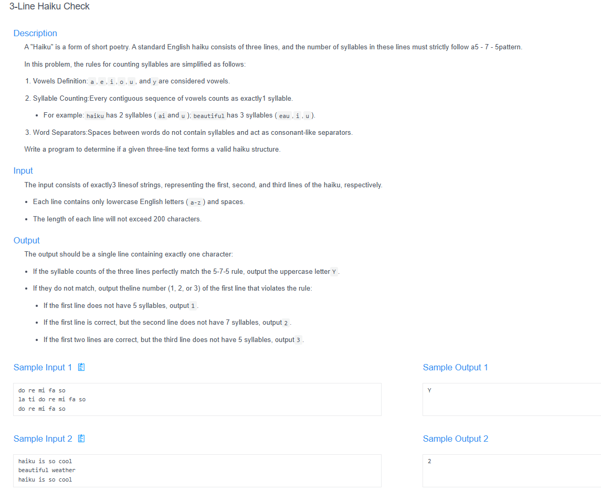

# 🧠 Detailed Problem Analysis: 3-Line Haiku Check

## 📋 Problem Description

- **Official Platform Link:** [Haiku Check](https://cpex.cs.pu.edu.tw/contest/6/problem/ACP2026-Q5)

---

## 🛠️ Section 1: Analyze INPUT

According to the technical specifications analyzed from the Padlet E testing system notes:
- **Input Structure:** The input consists of exactly 3 lines of strings, representing the three individual lines of a Haiku poem.
- **Constraints & Specifications:**
  - **Character Set:** Each line contains only lowercase English letters (`a`-`z`) and spaces. No uppercase letters, numbers, or punctuation marks are allowed.
  - **Length Limit:** The length of each line will not exceed 200 characters.
  - **Vowel & Syllable Definition:** The problem defines 6 specific vowels: `a`, `e`, `i`, `o`, `u`, and `y`.
  - **Syllable Counting Rule:** A syllable is defined as a contiguous sequence of vowels. Consecutive vowels (e.g., `ea`, `oi`, `ouy`) are grouped together and counted as a single syllable.

---

## 📐 Section 2: Design PROCESS

The core verification framework relies on counting vowel groups for each line and checking them against the standard Haiku rule matrix:

### 1. Architectural Rules
- **Target Syllable Pattern:** A valid Haiku poem must strictly follow the **5-7-5** syllable distribution rule:
  - **Line 1:** Must contain exactly **5** syllables.
  - **Line 2:** Must contain exactly **7** syllables.
  - **Line 3:** Must contain exactly **5** syllables.
- **Vowel Grouping Tracking Logic:** Iterate through each character of a line string. Use a boolean state variable flag (`inside_vowel_group`) to detect transitions:
  - If the character is a vowel and `inside_vowel_group` is `False`, increment the syllable counter and set the flag to `True`.
  - If the character is a vowel and `inside_vowel_group` is `True`, bypass it (part of the same syllable).
  - If the character is a space or consonant, reset the flag to `False`.

---

## 📤 Section 3: Plan OUTPUT

The system output must conform strictly to the target response format expected by the online evaluation system:
- **Successful Validation:** If all three lines exactly satisfy the 5-7-5 pattern, print the uppercase character:
  `Y`
- **Validation Failure:** If any line violates its required syllable count, the system stops evaluating immediately and prints the **1-based index number** of the first offending line:
  - `1` (If Line 1 does not equal 5)
  - `2` (If Line 1 is valid but Line 2 does not equal 7)
  - `3` (If Lines 1 and 2 are valid but Line 3 does not equal 5)

---

## 🗄️ Section 4: Data Container

The memory allocation model handles tracking metrics using primitive stacks and lightweight sequential sequences:
- **Text Array Containers (`lines`):** A string array list storing the 3 individual input strings.
- **Expected Constraints Register (`expected`):** A fixed integer array containing `[5, 7, 5]` to represent the mandatory validation benchmarks.
- **State Controller (`inside_vowel_group`):** A boolean flag register indicating whether the iterator loop is currently moving inside an active vowel block.

### Container Lifespan Lifecycle Table (Tracing a Sample Text Iteration):
| Processing Stage | Active Token / Char | `inside_vowel_group` State | Syllable Accumulator | Structural Action Taken |
| :--- | :--- | :--- | :--- | :--- |
| **1. Init Line Loop**| N/A | `False` | `0` | Reset parameters for the active string row. |
| **2. Read Vowel** | `'r'` $\rightarrow$ `'e'` | `True` | `1` | Detected vowel; triggered start of syllable 1. |
| **3. Read Vowel** | `'a'` (in `"rea"`) | `True` | `1` | Contiguous vowel group; bypassed increments. |
| **4. Read Consonant**| `'d'` | `False` | `1` | Detected consonant; closed active vowel group. |
| **5. Finish String** | N/A | N/A | `5` | Loop ended; ready to compare with pattern rules. |

---

## 🚀 Section 5: Algorithm

The sequential execution algorithm follows these precise procedural steps:
1. **Step 1 (Input Parse):** Read three individual lines of text strings from the input stream and store them in the `lines` matrix layer.
2. **Step 2 (Define Blueprint):** Initialize the verification layout array: `expected = [5, 7, 5]`.
3. **Step 3 (Process Syllables):** For each line index `i` from 0 to 2, calculate its total syllables:
   - Initialize `count = 0` and `inside_vowel_group = False`.
   - Loop through each character `ch` in `lines[i]`:
     - If `ch` belongs to the vowel character set (`a, e, i, o, u, y`):
       - If `inside_vowel_group` is `False`, increment `count` by 1 and set `inside_vowel_group = True`.
     - Else (consonant or space), set `inside_vowel_group = False`.
4. **Step 4 (Pattern Evaluation Check):** Compare the calculated `count` against `expected[i]`:
   - If `count != expected[i]`, immediately print the 1-based index number `i + 1` and terminate the program execution.
5. **Step 5 (Successful Completion):** If the validation loop finishes completely without triggering an error mismatch, output the completion character flag `"Y"`.

---

## 🔗 References
- **My Solution :** [haiku_checker.py](haiku_checker.py)
- **Academic Reference Portfolio:** [link](https://padlet.com/htchutaiwan/cpe-code-studies-padlet-e-hha1w2zhg9qzw1wj)
