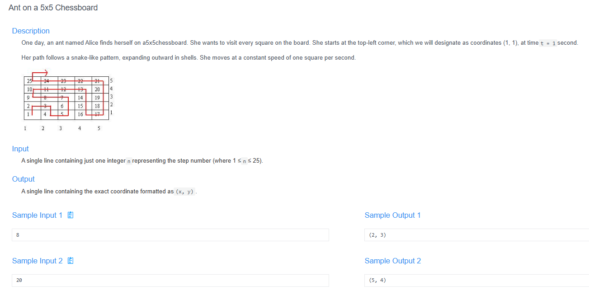
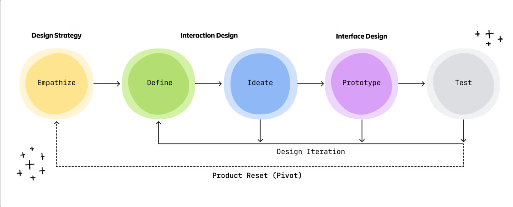

# 🧠 Detailed Problem Analysis: Ant on a 5x5 Chessboard (Spiral/Snake Path)

## 📋 Problem Description

- **Official Platform Link:** [Ant on a 5x5 Chessboard](https://cpex.cs.pu.edu.tw/contest/6/problem/ACP2026-Q2)

---

## 🛠️ Section 1: Analyze INPUT

According to the technical parameters from the Padlet system notes:
- **Core Goal:** Determine the exact $(X, Y)$ coordinate position of an ant on an expanding, snake-like spiral grid at a specific second $n$.
- **Input Format:** A single positive integer $n$ representing the elapsed time in seconds.
- **Constraints:** - $1 \le n \le 25$ (for a closed $5 \times 5$ chessboard matrix evaluation).
  - The input must be a positive integer, meaning it cannot be zero, negative, or a decimal fraction.
- **Input Mapping Matrix Lookups:** - Input: `1` $\rightarrow$ Expected Output: `(1, 1)`
  - Input: `3` $\rightarrow$ Expected Output: `(2, 2)`
  - Input: `6` $\rightarrow$ Expected Output: `(3, 2)`
  - Input: `23` $\rightarrow$ Expected Output: `(3, 5)`

---

## 📐 Section 2: Design PROCESS

The processing layout divides the expanding matrix graph into concentric structural layers called **Shells** (or rings).

### 1. Mathematical Induction Rules
- **Find the Shell Number ($S$):** The shell index matches the ceiling of the square root of time $n$:
  $$S = \lceil \sqrt{n} \rceil$$
- **Maximum Value of Previous Shell:** The highest value wrapped by the internal sub-boundary layer is defined as:
  $$\text{Prev\_Max} = (S - 1)^2$$
- **Determine the Offset ($O$):** Find how far $n$ has advanced into its active outer shell layer:
  $$\text{Offset} = n - \text{Prev\_Max}$$
- **Coordinate Calculation based on Parity:**
  - **Case 1: When Shell $S$ is ODD**
    - The path moves from top to bottom, then left to right.
    - If $\text{Offset} \le S$: $X = S$, $Y = \text{Offset}$
    - If $\text{Offset} > S$: $X = 2S - \text{Offset}$, $Y = S$
  - **Case 2: When Shell $S$ is EVEN**
    - The path moves from left to right, then bottom to top.
    - If $\text{Offset} \le S$: $X = \text{Offset}$, $Y = S$
    - If $\text{Offset} > S$: $X = S$, $Y = 2S - \text{Offset}$

### 2. Flowchart Logic

*Figure: Architectural blueprint displaying mathematical shell extractions and dynamic coordination offset paths.*

---

## 📤 Section 3: Plan OUTPUT

The presentation structure must match the targeted online evaluation interface syntax rules:
- **Output Content:** Display the terminal positional coordinate grid dimensions corresponding to the evaluated second $n$.
- **String Formatting Requirements:** The positional data token layout must match the strict tuple notation string structure: `(X,Y)` with parenthesis delimiters and no inner blank spaces.
- **Target Layout Examples:**
  - `(1,1)`
  - `(3,2)`
  - `(3,5)`

---

## 🗄️ Section 4: Data Container

The algorithm utilizes optimized primitive standard allocation spaces to compute metrics instead of storing whole matrices in heap branches:
- **Time Metric Register (`n`):** An integer primitive taking the raw second value input parameters.
- **Structural Bounds Counters (`shell`, `offset`):** Variables tracking active structural layer metadata markers.
- **Coordinate Holders (`x`, `y`):** Integer registers holding calculated output tokens before rendering.

### Container Lifespan Lifecycle Table (Tracing Input $n = 6$):
| Processing Phase | Evaluated Property | State in Memory | Structural Action Details |
| :--- | :--- | :--- | :--- |
| **1. Load Data** | `n` | `6` | Allocated core parameter registers. |
| **2. Shell Eval** | `shell = ceil(sqrt(6))` | `3` | Identified that index 6 belongs to Shell 3 (Odd). |
| **3. Distance** | `offset = 6 - (3-1)^2` | `2` | Computed distance offset parameter within layer 3. |
| **4. Map Rules** | `offset <= shell` (2 <= 3) | `True` | Triggered Odd Shell Condition A: $X = \text{shell}$, $Y = \text{offset}$. |
| **5. Core Buffers**| `(x, y)` | `(3, 2)` | Position coordinates locked into target registers. |
| **6. Output Flush**| String Format | `"(3,2)"` | Printed formatted string buffer to screen. |

---

## 🚀 Section 5: Algorithm

The sequential implementation algorithm tracks the problem execution flow step-by-step:
1. **Step 1 (Input):** Extract the streaming value representing elapsed seconds into the tracking register `n`.
2. **Step 2 (Determine Layer):** Compute the current bounding shell ring layer boundary via `shell = math.ceil(math.sqrt(n))`.
3. **Step 3 (Calculate Progress):** Find the index movement scale using `offset = n - (shell - 1) ** 2`.
4. **Step 4 (Parity Routing Check):** Branches depend on the parity of the current shell level:
   - If `shell % 2 != 0` (Odd Ring): Route validation to sub-branch conditional processing arrays for odd progressions.
   - If `shell % 2 == 0` (Even Ring): Route validation to sub-branch conditional processing arrays for even progressions.
5. **Step 5 (Compute Positional Coordinate Values):** Map specific parameters into the coordinate outputs `x` and `y`.
6. **Step 6 (Terminal Presentation Output Flush):** Encapsulate the result values into formatting buffers and print them to match the target string structure: `(X,Y)`.

---

## 🔗 References
- **My Solution :** [ant_spiral_chessboard.py](ant_spiral_chessboard.py)
- **Academic Reference Portfolio:** [link](https://padlet.com/htchutaiwan/cpe-code-studies-padlet-b-189wwj094m5vy3ro)
