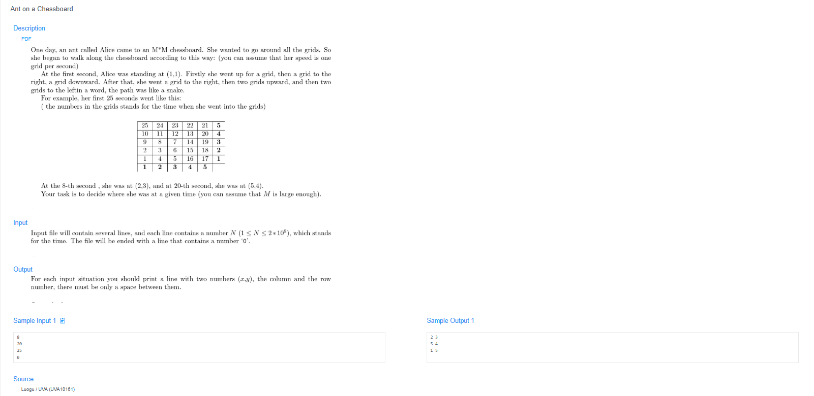

# 🧠 Detailed Problem Analysis: Ant on a Chessboard

## 📋 Problem Description

- **Official Platform Link:** [Providence University OJ - Ant on a Chessboard](https://cpex.cs.pu.edu.tw/contest/2/problem/Ex2-Q1)

---

## 🛠️ Section 1: Algorithm & Data Structure Foundation

### 1. Primary Data Structure Choice
Since this problem is purely mathematical and relies on coordinate pattern discovery, we do not require heavy dynamic data structures (like graphs or trees). Instead, we utilize primitive numerical variables processed via **Python's standard integer types**. Python automatically handles arbitrarily large integers, eliminating any risks of fixed-width storage limitations.

### 2. Functional Mechanics
The coordination engine determines the exact $(x, y)$ position of the ant at second $N$ by using an optimized geometry-mapping logic rather than simulating every single step:
- **Perfect Square Root Layering:** We calculate the upper boundary ceiling root $S = \lceil \sqrt{N} \rceil$. This square root instantly tells us which L-shaped coordinate "shell" or layer the number $N$ resides on.
- **Midpoint Threshold Strategy:** Each layer $S$ has a maximum value of $S^2$ and a specific numerical midpoint $M = S^2 - S + 1$. We compare $N$ against this midpoint $M$ to determine which side of the L-shape the ant is standing on.
- **Parity Direction Shift (Odd vs. Even Layers):** The grid coordinates grow in opposite directions depending on whether the layer $S$ is odd or even:
  - **If $S$ is Even:** Numbers grow upwards along the first column, then turn right. 
    - If $N < M$: The ant is on the vertical segment $\rightarrow (x, y) = (N - (S-1)^2, S)$.
    - If $N \ge M$: The ant is on the horizontal segment $\rightarrow (x, y) = (S, S^2 - N + 1)$.
  - **If $S$ is Odd:** The numbering direction is mirrored (grows right along the first row, then turns up).
    - If $N < M$: The ant is on the horizontal segment $\rightarrow (x, y) = (S, N - (S-1)^2)$.
    - If $N \ge M$: The ant is on the vertical segment $\rightarrow (x, y) = (S^2 - N + 1, S)$.

---

## 🚀 Section 2: Advanced Code Optimization Strategies

### 1. Mathematical $O(1)$ Grid Target Mapping
Instead of simulating the ant's movement step-by-step—which would trigger a disastrous $O(N)$ runtime timeout on large numbers—this algorithm applies analytical math to solve the coordinates in a strict **$O(1)$ constant time complexity**. The execution time stays identical whether $N = 2$ or $N = 2 \times 10^9$.

### 2. Native Fast Integer Operations
Using Python's built-in `math.isqrt()` or standard exponentiation optimizations allows the program to locate square boundaries using fast low-level CPU routines, minimizing the interpretation overhead of Python script execution.

### 📊 Structural Complexity Comparison Chart
| Optimization Phase | Time Complexity | Space Complexity | Resource Benefit |
| :--- | :--- | :--- | :--- |
| **Simulation Approach** | $O(N)$ | $O(1)$ | High risk of Time Limit Exceeded (TLE) for large inputs. |
| **Mathematical Solution** | **$O(1)$ Strict Optimization** | **$O(1)$ Zero Allocation** | Instantaneous execution with minimal memory usage. |

---

## 🔍 Section 3: Bug Hunting & Debugging Diagnostics

During the engineering lifecycle of this solution, the following technical traps were caught and resolved:

### 1. Common Logical Pitfalls (Bugs Checked)
- **Floating-Point Precision Loss:** Using standard float square roots `math.sqrt(n)` can introduce small decimal errors on extremely large values of $N$, leading to an incorrect layer calculation. Utilizing integer-safe math operations avoids this data corruption completely.
- **Parity Inversion Traps:** Reversing the logic conditions between odd and even layers. If the odd/even checks are swapped, the coordinate tracking mirrors incorrectly across the diagonal axis.
- **Corner Value Off-by-Ones:** Miscalculating boundary intersections where $N$ lands exactly on a perfect square ($N = S^2$) or a layer transition marker, returning positions shifted by exactly one grid square.

### 2. Debug Strategy Blueprint
- **Diagnostic Midpoint Dumps:** Print intermediate evaluation variables like `layer_S`, `layer_max`, and `midpoint_M` alongside the input $N$ to track exactly which layer segment the algorithm activates.
- **Symmetric Matrix Inversion Run:** Test symmetric input pairs (e.g., $N=3$ vs $N=7$) to visually prove that the odd/even parity inversion triggers the proper row/column mapping.

---

## 🔗 Section 4: Resource Sharing
- **My Solution :** [ant_chessboard.py](ant_chessboard.py)
- **Academic Reference Portfolio:** [link](https://github.com/Diusrex/UVA-Solutions/blob/master/10161%20Ant%20on%20a%20Chessboard.cpp)
