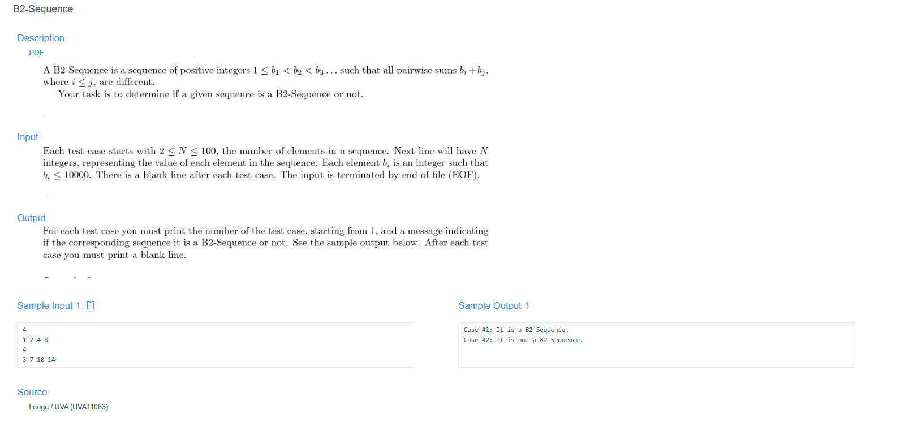

# 🧠 Detailed Problem Analysis: B2-Sequence

## 📋 Problem Description

- **Official Platform Link:** [B2-Sequence](https://cpex.cs.pu.edu.tw/contest/1/problem/Ex1-Q4)

---

## 🛠️ Section 1: Algorithm & Data Structure Foundation

### 1. Primary Data Structure Choice
To validate the mathematical uniqueness constraint of the sequence, the following storage layout is deployed:
- **Hash Set (`std::unordered_set<int>`) or Boolean Tracker (`std::vector<bool>`):** Stores every calculated pairwise sum ($a_i + a_j$). A hash-based tracking container provides an average time complexity of $O(1)$ for insertion and lookup operations, making it extremely efficient to identify duplicate sums instantly.
- **Sequence Vector (`std::vector<int>`):** Stores the initial input array of size $N$ to preserve sorted indexes for nested element combinations.

### 2. Functional Mechanics
The validation engine processes the input parameters sequentially through three strict conceptual gates:
- **Sequence Integrity Check:** Loops through the input to confirm two core prerequisite constraints:
  1. **Positive Boundary:** Every element must satisfy $a_1 \ge 1$.
  2. **Strictly Monotonic Increasing:** Every adjacent pair must satisfy $a_i < a_{i+1}$. If either rule is breached, the sequence is instantly flagged as invalid.
- **Pairwise Sum Generation:** A nested loop structures combinations where $i$ scans from $0 \rightarrow N-1$ and $j$ scans from $i \rightarrow N-1$. This guarantees that all identical-element additions ($a_i + a_i$) and unique-element additions ($a_i + a_j$) are fully generated without duplicate mirror computations.
- **Collision Detection Strategy:** Prior to committing a new sum $S = a_i + a_j$ to the set container, the engine executes a lookup verification. If $S$ already exists in the cache tracker, a mathematical collision has occurred, the verification loop breaks early, and the system declares the array as "not a B2-sequence."

---

## 🚀 Section 2: Advanced Code Optimization Strategies

To process multiple test cases reliably within standard execution limits, the solution integrates two direct optimizations:

### 1. Early-Exit Failure Triggers
Instead of generating all possible sums into memory before checking for duplicates, the collision inspector is nested directly inside the sum generation loop. The moment the first duplicate sum is discovered, the function triggers an immediate early return. This optimization drops unnecessary computations from $O(N^2)$ down to a fraction of that time on invalid inputs.

### 2. Memory Stabilization via Fast I/O
Since Online Judges process this specific problem using high-volume batch text files containing multiple sequence blocks, input streaming overhead can cause bottlenecks. Integrating decoupling flags (`std::ios_base::sync_with_stdio(false)`) optimizes system buffer speeds.

### 📊 Structural Complexity Comparison Chart
| Optimization Phase | Time Complexity | Space Complexity | Resource Benefit |
| :--- | :--- | :--- | :--- |
| **Brute-Force Nested Verification** | $O(N^4)$ | $O(1)$ | High risk of Time Limit Exceeded (TLE) on large arrays. |
| **Hash Set Lookup Model** | $O(N^2)$ | $O(N^2)$ | Guarantees rapid $O(1)$ sum duplication check. |
| **Optimized Early-Exit Vector** | $\le O(N^2)$ | $O(\text{Max Sum})$ | Fast cache lookups with immediate loop breaks. |

---

## 🔍 Section 3: Bug Hunting & Debugging Diagnostics

During the engineering lifecycle of this solution, the following technical traps were caught and resolved:

### 1. Common Logical Pitfalls (Bugs Checked)
- **Nested Loop Boundary Faults (`i <= j` vs `i < j`):** Forgetting that the problem explicitly allows adding a number to itself ($a_i + a_i$). If the inner loop is initialized as `for (int j = i + 1; ...)`, the system skips self-addition logic, causing false positive passes.
- **Strict Monotonic Failure:** Checking only if the sequence is sorted ($\le$) instead of strictly increasing ($<$). Duplicate items in the input (e.g., $1, 2, 2, 3$) must be rejected at initialization.
- **Output Blank Line Specifications:** Missing formatting rules regarding trailing whitespace or specific case numbering configurations (e.g., `Case #x: It is a B2-sequence.`) followed by a single empty line, causing a *Presentation Error*.
- **State Reset Neglect:** Forgetting to clear or reinitialize the hash set container and tracking variables between consecutive batch test cases, causing data leakage from previous runs to corrupt current evaluations.

### 2. Debug Strategy Blueprint
- **Trace Pair Matrix:** Add log dumps to print each pairing pair $(a_i, a_j)$ and their sum to visually confirm that the self-pairing threshold ($i=j$) is executing successfully.
- **Edge Case Tracking:** Hand-trace minimal inputs such as $N=1$ to ensure edge cases exit correctly, and check boundary arrays starting below $1$ to confirm positive integer checking flags.

---

## 🔗 Section 4: Resource Sharing
- **My Solution :** [b2_sequence_optimized.cpp](b2_sequence_optimized.cpp)
- **Academic Reference Portfolio:** [link](https://hackmd.io/@Rissun/H16hwWs3A)
