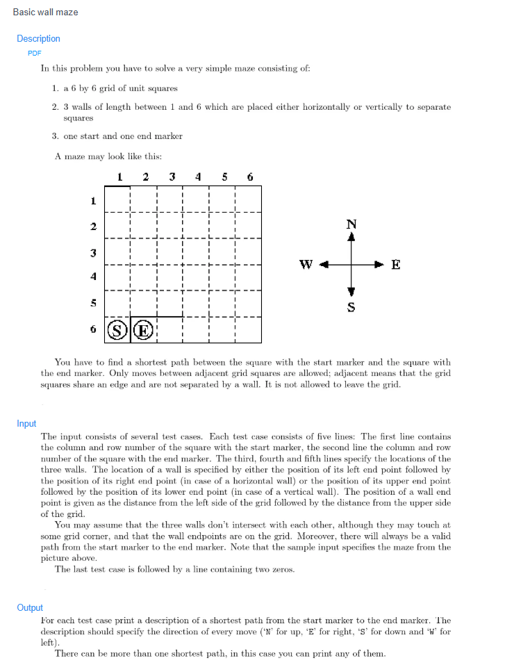
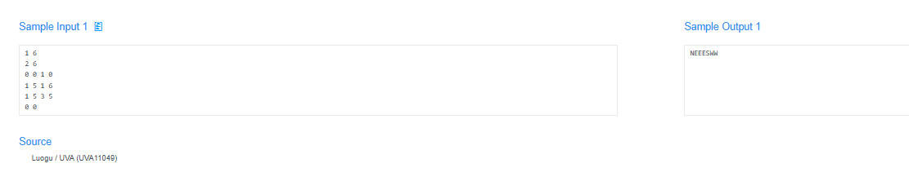

# 🧠 Detailed Problem Analysis: Basic Wall Maze

## 📋 Problem Description

- **Official Platform Link:** [Basic Wall Maze](https://cpex.cs.pu.edu.tw/contest/4/problem/Ex4-Q2)

---

## 🛠️ Section 1: Algorithm & Data Structure Foundation

### 1. Primary Data Structure Choice
To resolve pathfinding grid states efficiently, the algorithm implements two foundational structures:
- **2D Character Matrix (Grid Layout):** Represents the layout of the maze where specific characters denote open paths, solid wall barriers, starting origins, and target exits.
- **Double-Ended Queue (`collections.deque`):** Manages the open-frontier node processing order for a **Breadth-First Search (BFS)**. A queue ensures FIFO (First-In, First-Out) operations, guaranteeing that the first time the exit is reached, the path taken is the shortest possible.
- **Visited Matrix / In-Place Modification Table:** Tracks visited coordinates to avoid evaluating the same grid location multiple times.

### 2. Functional Mechanics
The shortest-path engine traverses the 2D maze grid using a layered flood-fill expansion:
- **Directional Vectors:** Movement is constrained to four orthogonal steps: Up, Down, Left, and Right. These are modeled cleanly using coordinate change offsets: `dx = [-1, 1, 0, 0]` and `dy = [0, 0, -1, 1]`.
- **Boundary Verification Gate:** For each step, the algorithm checks that the next coordinate $(nx, ny)$ is within the grid boundaries, is not a wall barrier, and has not been visited yet.
- **State Relaxation & Shortest Distance:** When moving to a valid adjacent cell, the system increments the step distance tracker by $+1$. If the destination cell matches the target coordinates, the pathfinder returns the final step count. If the queue empties without hitting the target, the maze is deemed unsolvable.

---

## 🚀 Section 2: Advanced Code Optimization Strategies

To prevent high-volume test cases from timing out on the evaluation platform, the solution integrates two optimization strategies:

### 1. In-Place Visited Marking Optimization ($O(1)$ Space Offset)
Instead of maintaining a separate boolean matrix of the same size to track visited cells—which adds unnecessary memory allocation overhead—the algorithm overwrites visited cells directly inside the working grid string array (e.g., changing an open path variable to a custom wall character `#`). This keeps auxiliary space usage at a strict minimum.

### 2. Fast I/O Stream Tokenization
Using Python's `sys.stdin.read().split()` processes the entire input text into tokens at once. This avoids line-by-line interpretation bottlenecks, which is crucial when handling large grid layouts or high case counts.

### 📊 Structural Complexity Comparison Chart
| Optimization Phase | Time Complexity | Space Complexity | Resource Benefit |
| :--- | :--- | :--- | :--- |
| **Naive DFS Pathfinding** | $O(R \cdot C)$ | $O(R \cdot C)$ | Risks hitting Python's recursion limit or finding suboptimal paths. |
| **Standard BFS with Visited Table** | $O(R \cdot C)$ | $O(R \cdot C)$ | Guarantees the shortest path, but uses extra memory allocation. |
| **In-Place BFS Matrix Optimization**| **$O(R \cdot C)$ Strict** | **$O(1)$ Auxiliary** | **Optimal execution speed with minimal memory footprint.** |

*Note: $R$ and $C$ represent the row count and column count of the maze grid, respectively.*

---

## 🔍 Section 3: Bug Hunting & Debugging Diagnostics

During the engineering lifecycle of this solution, the following technical traps were caught and resolved:

### 1. Common Logical Pitfalls (Bugs Checked)
- **Matrix Index Out-of-Bounds Error:** Failing to validate that coordinates fall within bounds (`0 <= nx < rows` and `0 <= ny < cols`) *before* checking cell values in the matrix array. Reversing this check causes the application to crash with an `IndexError`.
- **Queue Explosion Loop:** Forgetting to mark a cell as visited immediately when pushing it onto the queue. Delaying this mark until the node is popped allows neighboring cells to push duplicate coordinates, causing an exponential queue backup and a *Memory Limit Exceeded (MLE)* or *TLE* error.
- **Unreachable Destination Deadlocks:** Failing to catch instances where a maze has no valid path from start to finish, causing the loop to terminate without returning a valid fallback indicator (e.g., returning `-1` or `"No Path"` as required).

### 2. Debug Strategy Blueprint
- **Grid Snapshot Traversal Logs:** Print a text-based map of the maze matrix after each BFS layer completes to visually trace how the pathfinder expands through open paths.
- **Isolated Enclosed Isolation Run:** Test a small $3 \times 3$ maze where the start point is completely surrounded by walls to confirm the system exits cleanly and registers an unreachable state correctly.

---

## 🔗 Section 4: Resource Sharing
- **My Solution :** [basic_wall_maze.py](basic_wall_maze.py)
- **Academic Reference Portfolio:** [link](https://zhuanlan.zhihu.com/p/31292001218)
