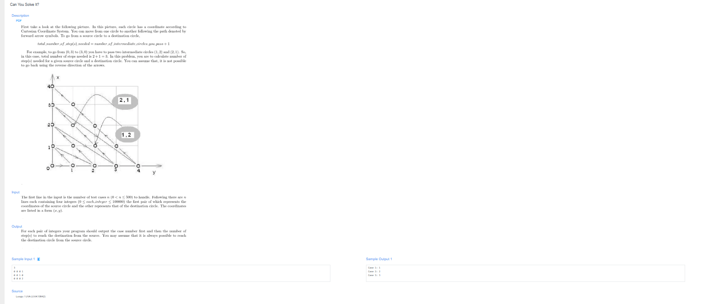

# 🧠 Detailed Problem Analysis: Can You Solve It?

## 📋 Problem Description

- **Official Platform Link:** [Can you solve it?](https://cpex.cs.pu.edu.tw/contest/3/problem/Ex3-Q2)

---

## 🛠️ Section 1: Algorithm & Data Structure Foundation

### 1. Primary Data Structure Choice
This problem maps a custom 2D coordinate system onto a linear sequence index, requiring **$O(1)$ constant auxiliary space**. No dynamic structural maps or graph collections are needed. Instead, we use primitive Python integer variables to mathematically compute the ordinal step index of any given point $(x, y)$ directly.

### 2. Functional Mechanics
The grid numbers are arranged in sequential diagonal bands where each coordinate $(x, y)$ can be converted into a single absolute 1D sequence step id, $S(x, y)$:
- **Diagonal Layer Identity:** The sum of coordinates $L = x + y$ identifies the specific diagonal layer the point sits on.
- **Base Element Accumulation:** The total number of coordinate elements packed inside all layers preceding layer $L$ is calculated using the standard arithmetic progression formula:
  $$\text{Base Steps} = \frac{L \cdot (L + 1)}{2} = \frac{(x+y) \cdot (x+y+1)}{2}$$
- **Intra-Layer Offset:** Within the active diagonal line $L$, the tracking index increments linearly as $x$ increases. Therefore, adding $x$ to the base calculation yields the final absolute 1D step index:
  $$S(x, y) = \frac{(x+y) \cdot (x+y+1)}{2} + x$$
- **Distance Formula Evaluation:** The shortest walking path distance between a starting coordinate $(x_1, y_1)$ and a destination coordinate $(x_2, y_2)$ is solved by finding the absolute difference between their 1D step indices:
  $$\text{Total Steps} = |S(x_2, y_2) - S(x_1, y_1)|$$

---

## 🚀 Section 2: Advanced Code Optimization Strategies

To efficiently handle high-volume batch queries from Online Judges without encountering runtime bottlenecks, the code implements two core optimization tiers:

### 1. Pure Mathematical Mapping ($O(1)$ Complexity)
Instead of running a grid simulation loop to trace steps point-by-point (which would cause severe $O(N)$ delays for large coordinate boundaries), converting points via the closed-form arithmetic progression formula cuts processing down to a **strict $O(1)$ constant time complexity**. 

### 2. Integer-Safe Operations
The math uses Python's floor division operator `//` instead of the standard division slash `/`. This forces the system to compute pure integer math at the CPU level, preventing any floating-point precision loss when handling large numbers.

### 📊 Structural Complexity Comparison Chart
| Optimization Phase | Time Complexity | Space Complexity | Resource Benefit |
| :--- | :--- | :--- | :--- |
| **Grid Path Simulation Loop** | $O(\Delta X + \Delta Y)$ | $O(1)$ | High risk of Time Limit Exceeded ($TLE$) on distant coordinates. |
| **Math Direct Formula Execution**| **$O(1)$ Strict** | **$O(1)$ Zero Allocation**| **Instantaneous execution with no precision loss.** |

---

## 🔍 Section 3: Bug Hunting & Debugging Diagnostics

During the engineering lifecycle of this solution, the following technical traps were caught and resolved:

### 1. Common Logical Pitfalls (Bugs Checked)
- **Misaligned Offset Mappings:** Accidentally using $y$ as the intra-layer offset instead of $x$. Because the problem's numbering runs from left to right along each diagonal, swapping the axis offsets flips the numbering sequence across the diagonal reflection line.
- **Float-to-Integer Rounding Drift:** Using regular float division (`/ 2`) can drop bits on very large coordinates, leading to inaccurate results. Using exact integer division (`// 2`) keeps the results precise.
- **Test Case Number Miscounts:** Forgetting to dynamically track and print the test case labels matching the output specification (e.g., `Case x: result`), which can trigger a *Wrong Answer (WA)* flag due to a string mismatch.

### 2. Debug Strategy Blueprint
- **Anchor Baseline Evaluation:** Manually verify small anchor points (such as $(0,0) \rightarrow 0$, $(0,1) \rightarrow 1$, and $(1,0) \rightarrow 2$) to make sure the math formula perfectly matches the sample grid pattern.
- **Zero Distance Check:** Pass identical points into the system (e.g., matching $(3, 4)$ to $(3, 4)$) to ensure the distance logic safely evaluates to exactly `0`.

---

## 🔗 Section 4: Resource Sharing
- **My Solution :** [can_you_solve_it.py](can_you_solve_it.py)
- **Academic Reference Portfolio:** [link](https://leetcode.com/)
