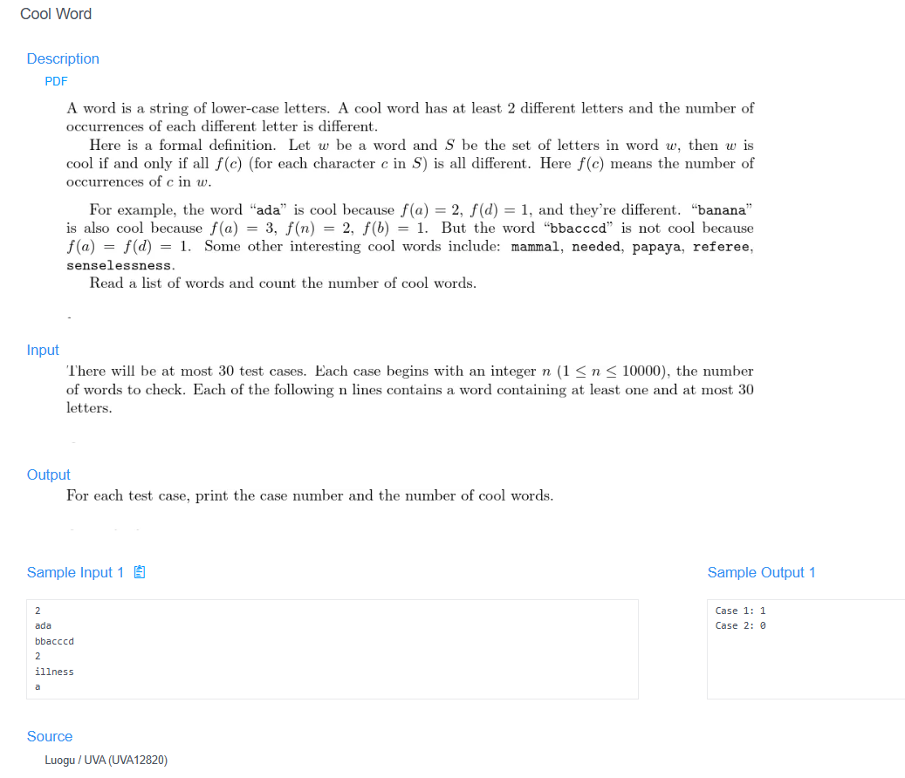

# 🧠 Detailed Problem Analysis: Cool Word Counter

## 📋 Problem Description

- **Official Platform Link:** [Cool Word](https://cpex.cs.pu.edu.tw/contest/6/problem/ACP2026-Q7)

---

## 🛠️ Section 1: Analyze INPUT

According to the testing layout specifications from the platform:
- **Test Case Boundaries:** The input stream contains multiple sequentially executed test cases. Each case block begins with a single positive integer $N$ representing the number of words to follow in that specific case ($1 \le N \le 10000$).
- **Word Elements:** The next $N$ rows each contain a single word string consisting entirely of lowercase English alphabet letters (`a` through `z`).
- **Length Constraint:** The length of each string element is bounded securely within standard memory sizes ($1 \le \text{length} \le 30$).
- **Termination Marker:** The input stream ends when there are no more tokens available (EOF - End of File).

---

## 📐 Section 2: Design PROCESS

The classification mechanics check whether a word qualifies as a "Cool Word" based on unique letter occurrences:

### 1. Verification Engineering Rules
- **Frequency Profile Extraction:** For any given word, compute the occurrence count of each distinct letter present.
  *Example:* For the word `"banana"`, the frequencies are: `b: 1`, `a: 3`, `n: 2`.
- **The "Cool Word" Definition Criteria:**
  1. The word must contain **at least 2 distinct letters**. (A single-letter word or a word where all letters are identical, like `"aaaa"`, can never have a diverse set of frequencies and is disqualified).
  2. Every single distinct non-zero count must be unique. No two letters can appear the exact same number of times.
- **Evaluation Logic Matrix:** - Word `"banana"` $\rightarrow$ Frequencies: `[1, 3, 2]`. Since $1 \neq 3 \neq 2$, all numbers are completely unique. Result: **Valid Cool Word**.
  - Word `"apple"` $\rightarrow$ Frequencies: `a: 1`, `p: 2`, `l: 1`, `e: 1`. Because the count `1` appears multiple times, it fails the uniqueness check. Result: **Invalid Word**.

---

## 📤 Section 3: Plan OUTPUT

The system output must conform strictly to the target response notation expected by the online evaluation tool:
- **Presentation Content:** For each test case block processed, print the accumulated total number of verified "Cool Words" found within that block.
- **Strict Layout Constraints:** The count must be formatted wrapped in a structured case prefix string matching the following pattern:
  `Case X: Count`
- **Output Examples:**
  - `Case 1: 2`
  - `Case 2: 0`

---

## 🗄️ Section 4: Data Container

The memory allocation strategy maps letter profiles using lightweight structural counter matrices:
- **Loop Boundary Counter (`N`):** Integer tracking the number of words inside the active case block.
- **Letter Bucket Vector (`frequency_map`):** An array sequence or map keeping track of character count tallies for the 26 lowercase English letters.
- **Uniqueness Evaluator (`unique_counts`):** A set hash structure used to collect non-zero frequencies to instantly check for duplicates.

### Container Lifespan Lifecycle Table (Tracing Evaluated Word `"banana"`):
| Processing Step | Structural Variables | Value State in Memory | Operational Analysis Details |
| :--- | :--- | :--- | :--- |
| **1. Clean States** | `frequency_map` | All 26 alphabet slots = `0` | Flushed and initialized data map block. |
| **2. Vector Accumulate**| `char` iteration | `b=1, a=3, n=2` | Iterated characters across `"banana"`. |
| **3. Filter Non-Zeros** | List compression | `[1, 3, 2]` | Extracted only the positive occurrences. |
| **4. Structural Set** | `unique_counts = set()` | `{1, 2, 3}` | Converted frequency list into a hash set. |
| **5. Length Assertion** | `len(list) == len(set)` | `3 == 3` (True) | Evaluated condition. Value is flagged as **Cool Word**. |

---

## 🚀 Section 5: Algorithm

The sequential execution algorithm follows these precise procedural steps:
1. **Step 1 (Initialize Loop Counter):** Initialize a global tracker to keep track of the test cases: `case_number = 1`.
2. **Step 2 (Read Loop Scale):** Continuously read the value $N$ from the stream until EOF is encountered.
3. **Step 3 (Initialize Match Accumulator):** Create a case-level running counter: `cool_word_count = 0`.
4. **Step 4 (Process Words Loop):** Loop exactly $N$ times to read each individual word string:
   - Create a clean frequency tracking list of size 26.
   - For each character in the word, calculate its index position `ord(char) - ord('a')` and increment that slot by 1.
   - Extract all non-zero values into a separate list called `counts`.
   - **Evaluate Validity:** If the total number of unique characters (`len(counts)`) is greater than or equal to 2, AND the size of its set conversion (`len(set(counts))`) is exactly equal to `len(counts)`:
     - Increment the accumulator: `cool_word_count += 1`.
5. **Step 5 (Format and Print):** Print the formatted result text: `Case X: cool_word_count`.
6. **Step 6 (Advance Case):** Increment `case_number` by 1 and loop back to Step 2.

---

## 🔗 References
- **My Solution :** [cool_word_counter.py](cool_word_counter.py)
- **Academic Reference Portfolio:** [link](https://www.luogu.com.cn/problem/list?type=UVA&page=90)
