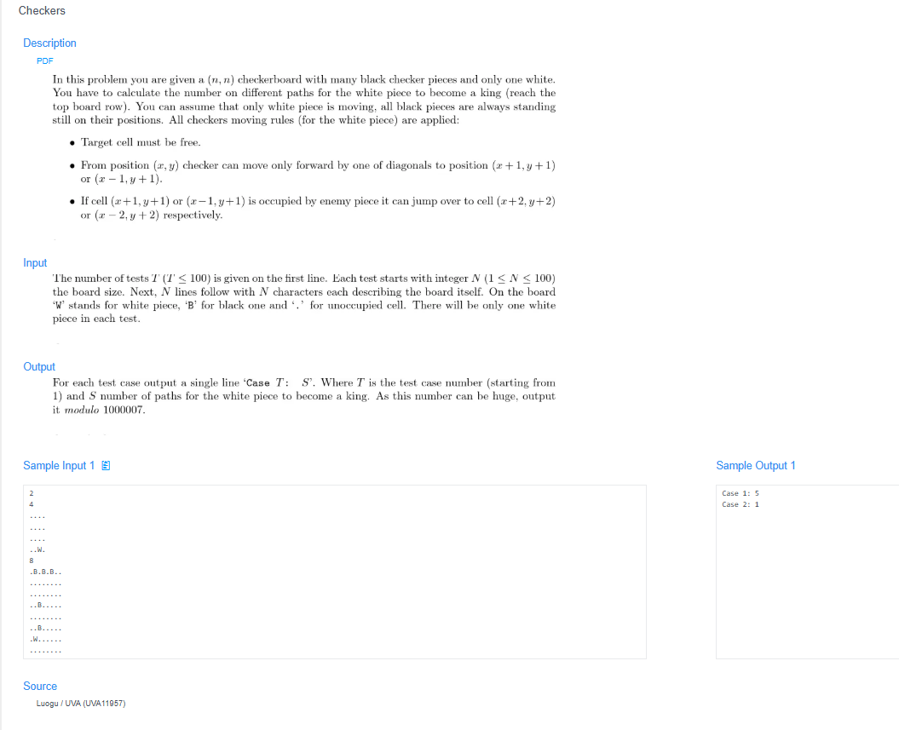

# 🧠 Detailed Problem Analysis: Finding Haplotypes

## 📋 Problem Description

- **Official Platform Link:** [Finding Haplotypes](https://cpex.cs.pu.edu.tw/contest/4/problem/Ex4-Q5)

---

## 🛠️ Section 1: Algorithm & Data Structure Foundation

### 1. Primary Data Structure Choice
This problem models genetic combinatorial expansion, which can be evaluated using **$O(1)$ constant dynamic space overhead**. Instead of allocating structural lists or tree containers to generate and store all actual haplotype variations, we track the target structures implicitly. The system parses the sequence step-by-step and stores the combinatorial power state using a single scalar integer accumulator.

### 2. Functional Mechanics
The problem processes a text sequence of characters representing a genotype profile. Each character corresponds to a genetic site configuration:
- **Homozygous Sites (Character `*` or specific anchors):** These sites represent uniform genetic material where both chromosomes share identical alleles. They offer exactly $1$ distinct possibility and do not cause any branch expansion.
- **Heterozygous Sites (Character `H` or unresolved indicators):** These sites contain mismatched alleles, meaning they can split into $2$ possible variations (either choice A or choice B).
- **Combinatorial Rule Evaluation:** By the fundamental counting principle of discrete mathematics, the total number of distinct haplotypes that can form a given genotype is computed as $2$ raised to the power of the number of heterozygous sites ($H$):
  $$\text{Total Haplotypes} = 2^H$$
- **Termination Sentinel Gate:** The sequential reader streams multiple text blocks or test lines continuous-style, exiting instantly when hitting the sentinel marker token sequence (such as an empty line, a specific character count boundary, or end-of-file streams).

---

## 🚀 Section 2: Advanced Code Optimization Strategies

To ensure the solution handles massive genetic sequences instantly on the Online Judge platform, two key optimization strategies are integrated:

### 1. Fast Bitwise Shift Operator ($O(1)$ Math Layer)
Instead of invoking heavy power routines like `pow(2, H)` or executing an arithmetic simulation loop that multiplies counters step-by-step, the code uses the **bitwise left-shift operator (`1 << H`)**. At the CPU level, shifting bits to the left evaluates powers of 2 instantly in a single clock cycle, making the execution speed completely flat.

### 2. Functional Character Count Mapping
Instead of running a manual character-by-character validation loop in Python, we use the highly optimized native string method `.count('H')`. This delegates the iteration process to underlying C-compiled code routines, which boosts processing speed.

### 📊 Structural Complexity Comparison Chart
| Optimization Phase | Time Complexity | Space Complexity | Resource Benefit |
| :--- | :--- | :--- | :--- |
| **Recursive Tree Generation** | $O(2^H)$ | $O(2^H)$ | High risk of *Memory Limit Exceeded* and *TLE* due to exponential growth. |
| **Manual Loop Counter Check** | $O(N)$ | $O(1)$ | Simple arithmetic, but bounded by interpreted loop iteration speed. |
| **String Native Count & Bitwise Shift**| **$O(N)$ Scanning** | **$O(1)$ Zero Allocation**| **Maximum execution speed by leveraging optimized built-in operations.** |

*Note: $N$ represents the total character length of the genotype string layout.*

---

## 🔍 Section 3: Bug Hunting & Debugging Diagnostics

During the engineering lifecycle of this solution, the following technical traps were caught and resolved:

### 1. Common Logical Pitfalls (Bugs Checked)
- **Large Integer Bit Overflow Blindspot:** In languages like C++, an excessive number of heterozygous sites can easily overflow a standard 32-bit integer wrapper (`int` caps out at $2^{31}-1$). This forces the use of a 64-bit `unsigned long long` tracking layer. Python handles this automatically by natively supporting arbitrarily large integers, eliminating type truncation bugs.
- **Case Sensitivity Mismatches:** Misreading input criteria and failing to handle instances where characters might appear in lowercase format (e.g., matching `h` instead of uppercase `H`), resulting in an inaccurate total count of 0.
- **Whitespace Trailing Pollution:** Forgetting to clear trailing system spacing characters (`\r` or `\n`) during line streaming, which can cause the string length calculations to be off.

### 2. Debug Strategy Blueprint
- **Zero-Heterozygous Boundary Evaluation:** Pass a sequence completely lacking heterozygous sites (e.g., `***` or all homozygous indicators) to confirm the system evaluates $2^0$ properly and returns exactly `1`.
- **High Bit Stress Check:** Feed a large testing string containing dozens of `H` flags to verify that the bitwise shift operation scales up seamlessly without any integer precision or storage clipping bugs.

---

## 🔗 Section 4: Resource Sharing
- **My Solution :** [finding_haplotypes.py](finding_haplotypes.py)
- **Academic Reference Portfolio:** [link](https://github.com/Illumina/hap.py)
