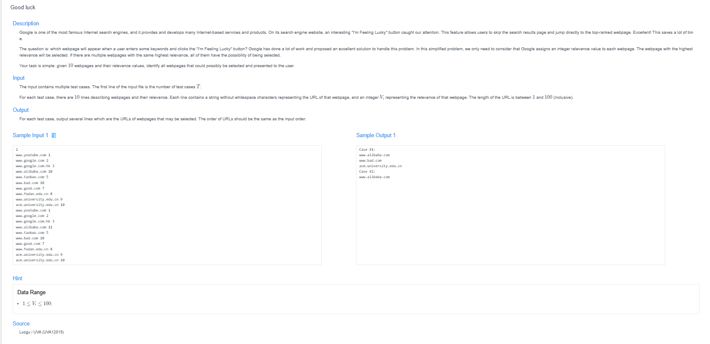

# 🧠 Detailed Problem Analysis: Good Luck 

## 📋 Problem Description

- **Official Platform Link:** [Good Luck](https://cpex.cs.pu.edu.tw/contest/2/problem/Ex2-Q2)

---

## 🛠️ Section 1: Algorithm & Data Structure Foundation

### 1. Primary Data Structure Choice
To determine the game outcomes efficiently, the algorithm relies on two essential computational components:
- **Prime Number Sieve Array (`std::vector<bool>` or Boolean Array):** Precomputes and caches the primality of all numbers up to the maximum constraints using the **Sieve of Eratosthenes**. This provides an $O(1)$ lookup time during state evaluation to identify legal game moves.
- **Dynamic Programming / Memoization State Array (`std::vector<int>`):** Stores the winning or losing status for each game state $N$. The values are defined dynamically as:
  - `0`: Uncalculated state.
  - `1`: Losing state (Current player will lose if both play optimally).
  - `2`: Winning state (Current player can force a win).

### 2. Functional Mechanics
The problem represents an impartial game played under normal play convention, which we model using **Game Theory (Combinatorial Game Theory)** rules and backward induction:
- **Base Case Setup:** The state $N = 0$ or $N = 1$ inherently represents a terminal **Losing State**. Since the rules require picking a prime number $p \le N$, if $N < 2$, no legal prime moves exist, causing the current player to lose immediately.
- **Minimax / Winning State Rule:** A state $N$ is classified as a **Winning State** if and only if there exists *at least one* valid prime $p$ such that subtracting it transitions the game into a known **Losing State** for the next player ($N - p$ is a Losing State).
- **Losing State Rule:** If *all* legal prime transitions from $N$ lead exclusively to Winning States for the next player, then $N$ is forced to be a **Losing State**.

---

## 🚀 Section 2: Advanced Code Optimization Strategies

### 1. Game State Precomputation (Linear DP)
Instead of invoking a deep recursive DFS with memoization for every single inquiry, which would cause heavy call-stack overhead, we perform a single linear **Bottom-Up Dynamic Programming** sweep up to the maximum target boundary. This guarantees that all inputs are resolved instantaneously via a direct index lookup.

### 2. Sieve Integration for Move Validation
By coupling the game state solver directly with a precomputed prime boolean filter, the inner loop only evaluates actual prime subtraction branches ($N - p$). It completely avoids checking composite numbers, minimizing the iteration space of the transitions.

### 📊 Structural Complexity Comparison Chart
| Optimization Phase | Time Complexity | Space Complexity | Resource Benefit |
| :--- | :--- | :--- | :--- |
| **Naive Recursive Theory** | $O(2^N)$ | $O(N)$ | High risk of Time Limit Exceeded (TLE). |
| **Memoized DFS Model** | $O(N \cdot \pi(N))$ | $O(N)$ | Caches repetitive sub-game trees. |
| **Bottom-Up DP + Sieve** | $O(N \cdot \pi(N))$ | $O(N)$ | Highly optimized lookups for batch text streaming. |

*Note: $\pi(N)$ represents the total number of primes less than or equal to $N$.*

---

## 🔍 Section 3: Bug Hunting & Debugging Diagnostics

### 1. Common Logical Pitfalls (Bugs Checked)
- **Base Case Misclassifications:** Incorrectly flagging $N=2$ or $N=3$ as losing states. Since $2$ and $3$ are primes, subtracting them reaches $0$, making them immediate winning states.
- **State Lookup Misalignment:** Confusing the winning condition logic—accidentally turning a state into a winning state if it can transition to *any* state, instead of strictly verifying that it transitions to a *losing* state.
- **Sieve Boundary Out-of-Bounds:** Failing to precompute primes up to the full global limits required by the test batches, causing runtime memory segmentation faults or false negative classifications.

### 2. Debug Strategy Blueprint
- **Small Terminal Sequence Tracing:** Explicitly print the evaluation grid from $0$ to $10$. Verify by hand that states $0, 1$ are Losing, while $2, 3, 4, 5$ correctly switch to Winning based on prime distance transitions.
- **Transition Step Verifier:** Inject diagnostic print logs inside the inner validation loops to inspect which exact prime $p$ transforms a target state $N$ into an optimized win.

---

## 🔗 Section 4: Resource Sharing
- **My Solution :** [good_luck_game.py](good_luck_game.py)
- **Academic Reference Portfolio:** [link](https://zerojudge.tw/ShowProblem?problemid=a130)
