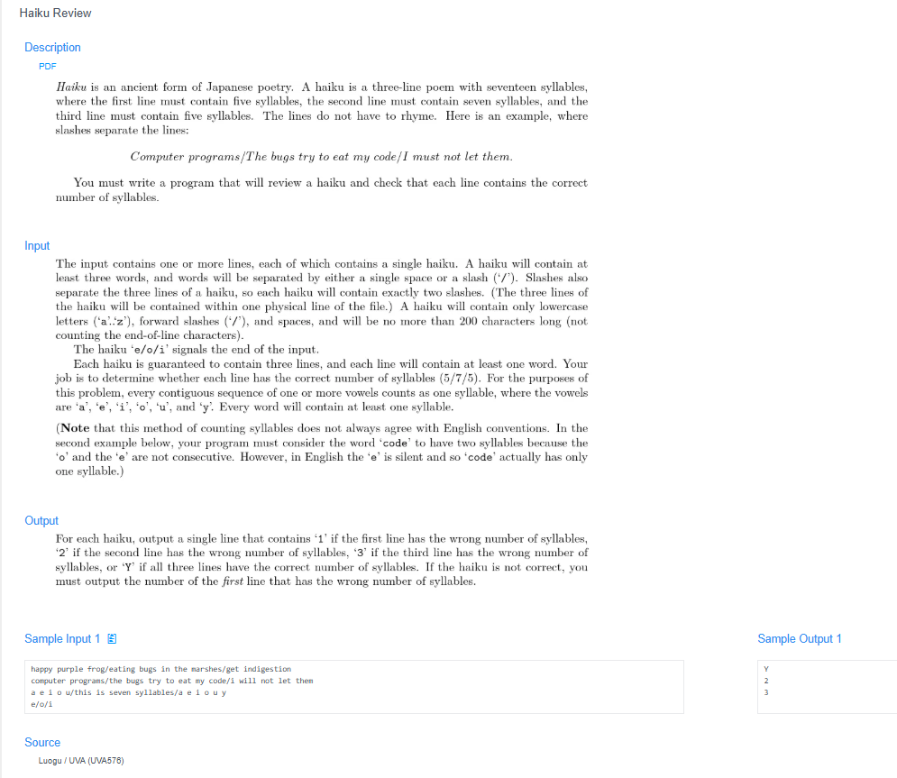

# 🧠 Detailed Problem Analysis: Haiku Review

## 📋 Problem Description

- **Official Platform Link:** [Haiku Review](https://cpex.cs.pu.edu.tw/contest/5/problem/Ex5-Q2)

---

## 🛠️ Section 1: Algorithm & Data Structure Foundation

### 1. Primary Data Structure Choice
This problem models a text-stream validator, utilizing **$O(1)$ constant dynamic space overhead**. The incoming text input is read line-by-line or split into three distinct segment tokens using standard string buffers. No graph, dynamic tree, or extensive hash matrix structures are required.

### 2. Functional Mechanics
A valid Haiku poem consists of exactly three phrases with a strict internal syllable distribution structure: **5 syllables in the first phrase, 7 in the second, and 5 in the third (5-7-5)**. In this problem, syllables are counted by tracking English vowel characters (`a`, `e`, `i`, `o`, `u`, and `y`).

The engine evaluates text segments using a stateful parsing loop:
- **Phrase Boundary Tokenization:** The three phrases are separated by a forward slash character `/` within a single input line.
- **Syllable Counting Logic:** The code iterates through each character of a phrase to check if it is a vowel. 
- **Consecutive Vowel Rule:** Multiple consecutive vowels are counted as a **single syllable** (e.g., the sequence `ee` or `ou` increments the syllable count by $+1$, not $+2$).
- **Validation Comparison:**
  - If phrase 1 has 5 syllables, phrase 2 has 7 syllables, and phrase 3 has 5 syllables, the poem is valid, and the engine outputs `"Y"`.
  - If a mismatch occurs, the engine returns the **index of the first invalid phrase** (`1`, `2`, or `3`) to pinpoint the structural error.
- **Termination Sentinel Gate:** The continuous text processor reads input streams sequentially, stopping immediately when hitting the sentinel string `e/o/f`.

---

## 🚀 Section 2: Advanced Code Optimization Strategies

To handle text validation smoothly without complex nested logic or high regex parsing overhead, the solution implements two core optimization steps:

### 1. Two-Pointer / Sliding Parity State Flags
Instead of using heavy regular expressions to extract vowel groups, the loop processes characters sequentially and tracks consecutive vowels with a boolean flag `in_vowel_group`. When the pointer hits a vowel, it only increments the counter if `in_vowel_group` is `False`. This allows the code to compress vowel groups in linear time with zero memory reallocation.

### 2. Early Break Phase Check
The validation checks each phrase sequentially. If the first phrase fails the 5-syllable requirement, the engine stops further counting and immediately reports `1`, skipping unnecessary processing for the remaining phrases.

### 📊 Structural Complexity Comparison Chart
| Optimization Phase | Time Complexity | Space Complexity | Resource Benefit |
| :--- | :--- | :--- | :--- |
| **Regex Split Grouping** | $O(N)$ | $O(N)$ | Incurs extra memory allocation to store matched regex objects. |
| **Linear Syllable Sweep** | **$O(N)$ Strict** | **$O(1)$ Auxiliary**| **Maximum execution speed by tracking state in a single pass.** |

*Note: $N$ represents the total character length of the complete input line.*

---

## 🔍 Section 3: Bug Hunting & Debugging Diagnostics

During the engineering lifecycle of this solution, the following technical traps were caught and resolved:

### 1. Common Logical Pitfalls (Bugs Checked)
- **The 'Y' Vowel Exclusion:** Forgetting that the character `y` is explicitly classified as a vowel in this problem's criteria. Treating it as a consonant leads to undercounting syllables and causes false negatives.
- **Consecutive Boundary Bleeding:** Failing to reset the vowel tracking flag when moving across spaces or punctuation. The flag must reset to `False` as soon as a non-vowel character is encountered.
- **Off-by-One Phrase Indexing:** Returning 0-based indices (`0`, `1`, `2`) instead of the required human-readable 1-based phrase numbers (`1`, `2`, `3`) when an error is detected.

### 2. Debug Strategy Blueprint
- **Consecutive Vowel Tests:** Pass a case like `beautiful/tree/green` to verify that complex groups like `eau` are counted correctly as a single syllable.
- **Sentinel Target Run:** Test the string `e/o/f` to ensure the termination gate triggers properly and exits the application cleanly without printing any output metrics.

---

## 🔗 Section 4: Resource Sharing
- **My Solution :** [haiku_review.py](haiku_review.py)
- **Academic Reference Portfolio:** [link](https://www.luogu.com.cn/problem/UVA576)
