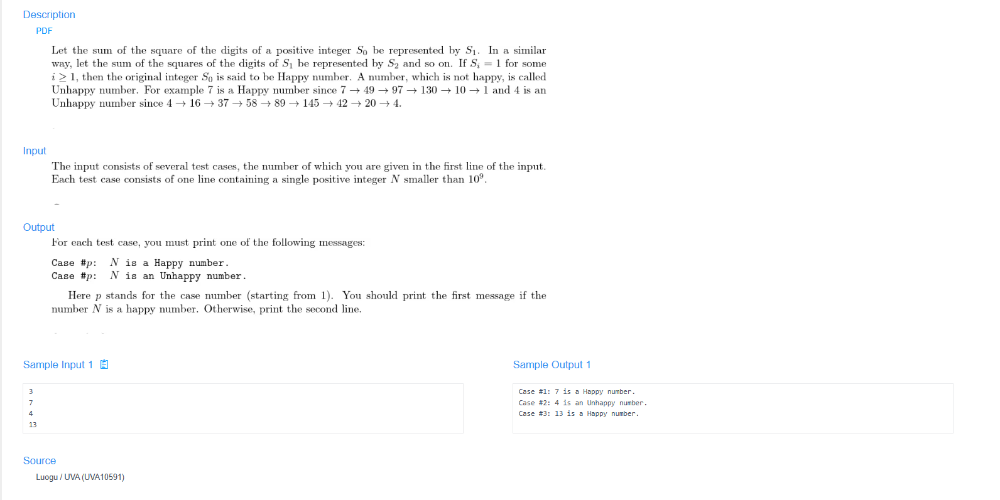

# 🧠 Problem Analysis: Happy Number

## 📋 Problem Description

- **Link:** [Happy Number](https://cpex.cs.pu.edu.tw/contest/1/problem/Ex1-Q1)

---

## 🛠️ Section 1: Algorithm & Data Structure Foundation

### 1. Primary Data Structure Choice
We implement a `std::unordered_set<int>` as our foundational tracking collection. This hash-based container memorizes every unique intermediate value generated throughout the square-sum sequence. It guarantees an average time complexity of $O(1)$ for lookup operations, making cycle identification highly efficient.

### 2. Functional Mechanics
The implementation operates via two explicit conceptual phases:
- **Digit Extraction:** A dedicated mathematical loop isolates individual positions using numerical base manipulation. It executes a sequence extracting the trailing integer via `n % 10` followed by structural reduction via `n / 10` to aggregate individual squares.
- **Trapping & Cycle Detection:** - **Success State:** If the computed aggregate converges directly to `1`, execution ceases and yields a boolean `true`.
  - **Loop Boundary:** Prior to proceeding to the next mathematical iteration, the system checks if the newly computed sum already exists within our set collection. If a match is found, a closed loop has occurred, execution terminates, and it yields a boolean `false`.

---

## 🚀 Section 2: Advanced Code Optimization Strategies

To improve computational throughput and eliminate external constraints, the solution evolved through two optimization tiers:

### 1. Space Optimization via Floyd's Cycle-Finding Algorithm
Instead of preserving an expanding `std::unordered_set` structure which incurs variable auxiliary memory overhead, we can refactor the execution footprint down to a rigid **$O(1)$ auxiliary space complexity**. 

By adapting **Floyd's Tortoise and Hare Algorithm**, we assign two virtual moving trackers across the mathematical sequence generation stream:
- **Slow Pointer (Tortoise):** Computes exactly 1 sequence step per iteration cycle ($f(x)$).
- **Fast Pointer (Hare):** Computes exactly 2 sequence steps per iteration cycle ($f(f(x))$).

If the sequence elements contain no terminal anomalies, the fast pointer will mathematically overlap with the slow tracker. If they intersect at value `1`, it is validated as a happy number; any other intersection boundary explicitly registers a memory-free cycle trap.

### 2. Performance Optimization via Hardcoded Cycle Paths
Mathematical data analysis proves that all unhappy trajectories inevitably fall into a single, definitive numeric cycle chain: `4 → 16 → 37 → 58 → 89 → 145 → 42 → 20 → 4`. By hardcoding evaluation flags against these key constant thresholds, execution can break early without waiting for pointer convergence.

### 📊 Structural Complexity Comparison Chart
| Optimization Phase | Time Complexity | Space Complexity | Resource Benefit |
| :--- | :--- | :--- | :--- |
| **Initial Hash Set Model** | $O(\log n)$ | $O(\log n)$ | Quick $O(1)$ set inspection. |
| **Floyd's Pointer Model** | $O(\log n)$ | **$O(1)$ Strict Optimization** | Zero dynamic heap allocation. |

---

## 🔍 Section 3: Bug Hunting & Debugging Diagnostics

During the engineering lifecycle of this solution, the following technical traps were caught and resolved:

### 1. Common Logical Pitfalls
- **Infinite Loop States:** Forgetting to commit new step evaluations to the tracking set container, or misaligning the discrete step-advancements of the slow/fast pointers, which caused runtime timeouts on unhappy inputs.
- **Digit Disruption Traps:** Implementing structural division operations (`n / 10`) prematurely before executing the remainder checks (`n % 10`), or omitting the final scale update (`n /= 10`), resulting in calculations being stuck on a single digit.
- **Order of Operations Anomalies:** Testing for a value's presence in the hash container *after* committing its placement rather than *before*, leading the engine to instantly trigger false positives on its own fresh state data.
- **C++ Template Compilation Warnings:** Omitting target type initializations inside standard container templates (e.g., typing generic `unordered_set` instead of standard structured type `unordered_set<int>`).

### 2. Isolation & Validation Blueprint
To prevent regression when applying optimizations, the testing phase utilizes these isolation rules:
- **Dry Running Core Edge Cases:** Ensuring that inputs $n=1$ trigger immediate truth returns, while running baseline cycle markers (such as $n=2$ or $n=4$) confirms clean structural exits.
- **Decoupled Function Inspection:** Extracting the arithmetic sum-of-squares block into an isolated helper routine to confirm it correctly evaluates multi-digit anomalies (e.g., testing $100$ or $99$ independently) before embedding it inside pointer code.
---

## 🔗 Section 4: Resource Sharing
- **My LeetCode Solution:** [Link to your LeetCode post]
- **Academic Reference:** [link](https://leetcode.com/problems/happy-number/solutions/6750358/video-2-solutions-using-remainder-and-tw-bwks/)
