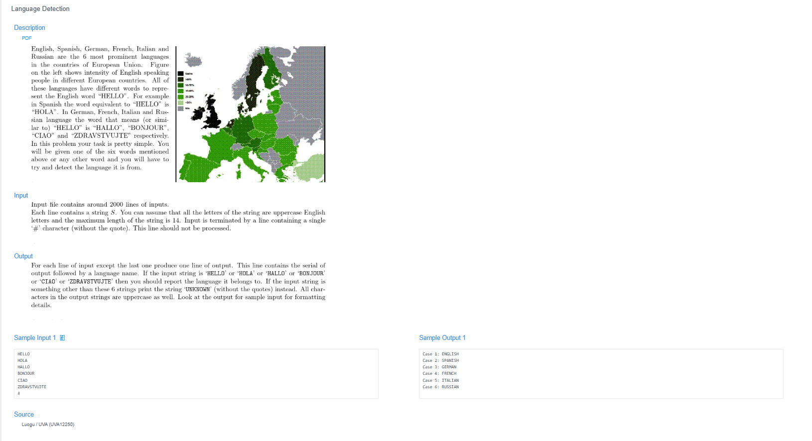

# 🧠 Detailed Problem Analysis: Language Detection

## 📋 Problem Description

- **Official Platform Link:** [Language Detection](https://cpex.cs.pu.edu.tw/contest/2/problem/Ex2-Q3)

---

## 🛠️ Section 1: Algorithm & Data Structure Foundation

### 1. Primary Data Structure Choice
The choice of data architecture depends heavily on the scale of the greeting library:
- **Procedural Selection (Naive):** For a handful of basic languages, the system uses linear conditional chains (`if-else` or `switch`) for direct string-to-string comparison.
- **Associative Mapping (Optimized):** To implement a more robust and scalable architecture, we deploy a **Hash Table** via C++ Standard Library's **`std::unordered_map<std::string, std::string>`**. This maps a unique greeting keyword directly to its corresponding language country label, providing an average time complexity of $O(1)$ for constant-time lookups.

### 2. Functional Mechanics
The translation system acts as a lookup engine that categorizes user inputs into specific languages based on recognized greeting keywords through three operational phases:
- **Sequential Word Processing:** The program continuously ingests tokenized string data from the input stream until it encounters a specific termination sentinel, the `#` character.
- **Pattern Matching & Case Normalization:** Each incoming string token is cross-referenced against the predefined associative dictionary of "Hello" variations (e.g., `"BONJOUR"`, `"HOLA"`, `"HELLO"`).
- **Result Attribution:** - If an exact match is found within the hash container, it logs and prints the corresponding verified language label.
  - If the token is unrecognized or missing from the dictionary, it falls back to a default `"UNKNOWN"` status label.

---

## 🚀 Section 2: Advanced Code Optimization Strategies

To improve computational throughput as the list of monitored world languages expands, the core source code integrates three efficiency strategies:

### 1. Key-Value Efficiency ($O(1)$ Direct Lookup)
Transitioning from long, nested logical `if-else` blocks to a centralized `std::unordered_map` structure shifts the search execution complexity from $O(N)$ (where the system must evaluate words one by one) down to a strict **$O(1)$ average complexity**, maximizing matching speed.

### 2. Case Normalization Rule
To eliminate the need to store multiple casing variations of the exact same word (e.g., caching `"Hello"`, `"HELLO"`, and `"hello"`), a normalization routine is added to convert all incoming strings to uniform uppercase before executing the dictionary lookup.

### 3. Early Sentinel Exit
Ensuring the loop termination check against the `#` character happens at the very beginning of the string ingestion loop. This avoids wasting CPU operations on unnecessary text normalization or lookup look-aheads for the sentinel itself.

### 📊 Structural Complexity Comparison Chart
| Optimization Phase | Time Complexity | Space Complexity | Resource Benefit |
| :--- | :--- | :--- | :--- |
| **Linear Logic Chain (`if-else`)** | $O(N \cdot \text{Languages})$ | $O(1)$ | Performance drops significantly as the language library grows. |
| **Hash Map Lookup** | **$O(1)$ Average** | $O(\text{Languages})$ | Instant keyword lookups with immediate returns. |
| **Normalized Hash Map** | **$O(1)$ Average** | **Optimized Storage** | Clean memory footprints; zero duplicate casing states. |

---

## 🔍 Section 3: Bug Hunting & Debugging Diagnostics

During the engineering lifecycle of this solution, the following technical traps were caught and resolved:

### 1. Common Logical Pitfalls (Bugs Checked)
- **Casing Discrepancies:** A failure to normalize input text strings before comparing them against dictionary keys. For instance, comparing lowercase `"hello"` against a cached uppercase `"HELLO"` key results in an erroneous `"UNKNOWN"` output for completely valid greetings.
- **Sentinel Omission Errors:** If the terminating `#` character is missing or mishandled within the input stream logic, the evaluation loop can enter an infinite loop state or experience a system buffer overflow.
- **Typo Sensitivity:** Misspelling internal country labels or greeting entries within the source configuration dictionary leads to persistent hidden logic failures during verification.

### 2. Debug Strategy Blueprint
- **Input Echoing:** Adding diagnostic code blocks to print the raw string values immediately before they enter comparison layers to verify that stream extraction did not corrupt the incoming text.
- **Corner Case Testing:** Manually injecting empty lines, mixed numbers, and standalone `#` tokens to rigorously verify the robustness of the system's exit condition.

---

## 🔗 Section 4: Resource Sharing
- **My Solution :** [language_detection.cpp](language_detection.cpp)
- **Academic Reference Portfolio:** [link](https://github.com/lzw108/Language-Detection)
