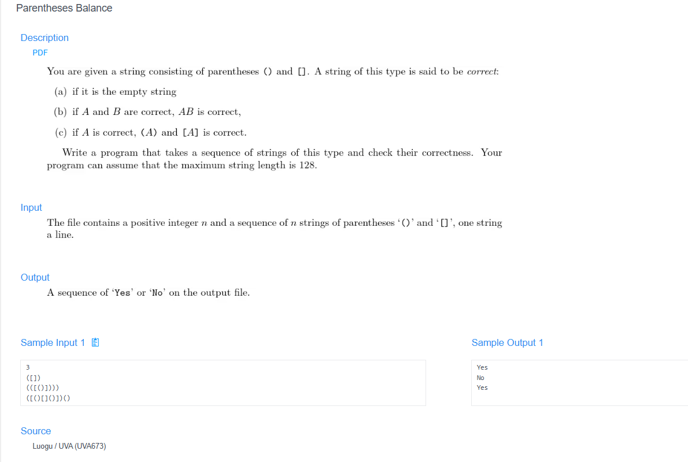

# 🧠 Detailed Problem Analysis: Parentheses Balance

## 📋 Problem Description

- **Official Platform Link:** [Parentheses Balance](https://cpex.cs.pu.edu.tw/contest/6/problem/ACP2026-Q6)

---

## 🛠️ Section 1: Analyze INPUT

According to the problem specifications derived from the platform interface:
- **Test Case Count ($n$):** The first row of the input stream supplies a single positive integer $n$, indicating the total number of test text strings to be processed sequentially.
- **String Content Block:** The subsequent $n$ rows each contain a string containing a mixed arrangement of parentheses `()` and square brackets `[]`.
- **Edge Conditions & Quirks:** - The input strings may contain empty spaces, tabs, or be entirely empty (zero-length string).
  - An empty line is explicitly defined by the problem system as a **correctly balanced** string instance.
  - Max string length constraints are capped safely within standard system input buffers ($\le 128$ characters per line).

---

## 📐 Section 2: Design PROCESS

The structural nesting configuration of bracket parsing is solved optimally by using a Last-In, First-Out (LIFO) stack layout:

### 1. Stack Evaluation Mechanics
- **Opening Tokens (`(`, `[`):** Whenever an opening bracket is detected during structural string iteration, push it directly onto the processing stack memory tracker.
- **Closing Tokens (`)`, `]`):** Whenever a closing bracket is encountered, validate the state of the stack:
  - If the stack is empty, it means there is a closing bracket without a matching opening bracket $\rightarrow$ **Invalid State**.
  - If the stack has elements, pop the top element and verify the pairing:
    - `)` must match with `(`
    - `]` must match with `[`
    - If the types mismatch, the balance is corrupted $\rightarrow$ **Invalid State**.
- **Post-Iteration Check:** Once the string line sweep completes, the stack must be completely empty. If elements remain unpopped, some opening brackets were never closed $\rightarrow$ **Invalid State**.

---

## 📤 Section 3: Plan OUTPUT

The system output layout must match the precise string flags expected by the grading server:
- **Successful Validation:** If a string balances properly according to nested scoping rules (or is entirely empty), print exactly:
  `Yes`
- **Validation Failure:** If any nesting violation, opening/closing mismatch, or orphaned bracket remains, print exactly:
  `No`
- **Formatting Constraints:** Each test case evaluation output must be printed on a fresh, standalone console row line. Capitalization is strict (`Yes` / `No`).

---

## 🗄️ Section 4: Data Container

The storage pipeline uses a linear sequence tracking structure to efficiently parse character frames:
- **Master Input Buffer (`line`):** A string object variable capturing individual text rows.
- **LIFO Evaluation Memory Block (`stack`):** A dynamic list container acting as a character stack tracking open frame wrappers.

### Container Lifespan Lifecycle Table (Tracing Input String: `([)]`):
| Processing Iteration | Scanned Token | Stack Array State | Logic Verification Evaluation | Structural Action Taken |
| :--- | :--- | :--- | :--- | :--- |
| **1. Step Start** | N/A | `[]` (Empty) | String loading initiated | Clear active stack buffer. |
| **2. Frame Open** | `'('` | `['(']` | Is an opening token symbol | Pushed character onto stack. |
| **3. Frame Open** | `'['` | `['(', '[']` | Is an opening token symbol | Pushed character onto stack. |
| **4. Frame Close**| `')'` | `['(', '[']` | Top element `['[']` doesn't pair with `')'` | **Failed:** Mismatch detected. Stop. |
| **5. Flush Output**| N/A | N/A | Global validity state evaluated to `False` | Print output result line: `"No"`. |

---

## 🚀 Section 5: Algorithm

The step-by-step logic execution pipeline runs according to these linear sequence bounds:
1. **Step 1 (Load Bounds):** Read the first input row to capture the loop limitation integer $n$.
2. **Step 2 (Iterate Cases):** Run a loop $n$ times. For each loop, read the target text line.
3. **Step 3 (Empty String Handling):** If the string length equals 0 (empty row), skip calculation, assign validity state as `True`, and jump directly to Step 6.
4. **Step 4 (Initialize Stack):** Create an empty evaluation container tracker list `stack`.
5. **Step 5 (Character Token Evaluation Sweep):** Loop across every character `ch` inside the string:
   - If `ch` is equal to `(` or `[`, push it to `stack`.
   - If `ch` is equal to `)`:
     - If `stack` is empty OR `stack.pop()` is not equal to `(`, assign validity state as `False` and break the loop.
   - If `ch` is equal to `]`:
     - If `stack` is empty OR `stack.pop()` is not equal to `[`, assign validity state as `False` and break the loop.
6. **Step 6 (Final Inspection):** After the character sweep loop completes, check if `stack` is empty and no failure flags were raised. If empty, the string is valid (`"Yes"`); otherwise, it is invalid (`"No"`).
7. **Step 7 (Console Output Flush):** Print the matching text string result on its own line.

---

## 🔗 References
- **My Solution :** [parentheses_balance.py](parentheses_balance.py)
- **Academic Reference Portfolio:** [link](https://www.youtube.com/watch?v=xwjS0iZhw4I)
