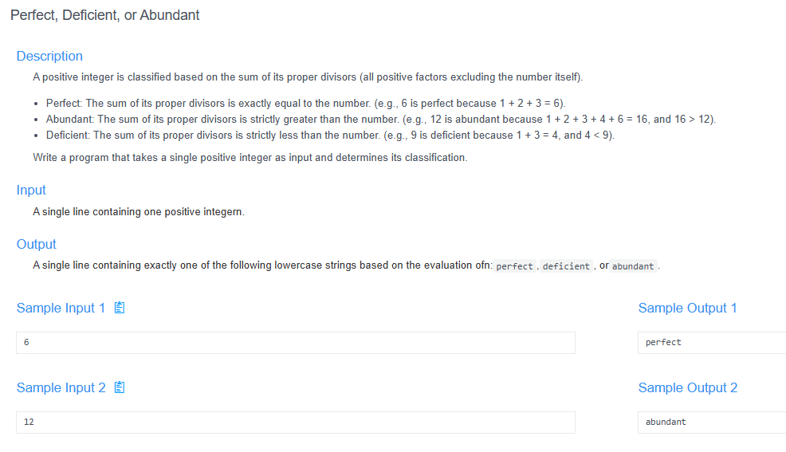

# 🧠 Detailed Problem Analysis: Perfect, Deficient, or Abundant Number Classification

## 📋 Problem Description

- **Official Platform Link:** [Perfect, Deficient, or Abundant Number Classification](https://cpex.cs.pu.edu.tw/contest/6/problem/ACP2026-Q3)

---

## 🛠️ Section 1: Analyze INPUT

According to the technical specifications from the Padlet system notes:
- **Core Input Structure:** The input consists of a single positive integer $n$.
- **Data Type:** Must be a positive integer ($n > 0$).
- **Sample Inputs Checked:** - `6`
  - `12`
  - `9`

---

## 📐 Section 2: Design PROCESS

The algorithm processes the problem by finding all proper divisors of $n$ and evaluating their accumulation:

### 1. Mathematical Classification Rules
- **Proper Divisor Definition:** A proper divisor of $n$ is any positive divisor of $n$ excluding $n$ itself (all numbers $i$ where $1 \le i < n$ and $n \pmod i == 0$).
- **Classification Logic Criteria:**
  - **Perfect Number:** The sum of all proper divisors is exactly equal to $n$ ($\text{sum} == n$).
    *Example:* $6$ is perfect because its proper divisors are $1, 2, 3$, and $1 + 2 + 3 = 6$.
  - **Abundant Number:** The sum of all proper divisors is strictly greater than $n$ ($\text{sum} > n$).
    *Example:* $12$ is abundant because its proper divisors are $1, 2, 3, 4, 6$, and $1 + 2 + 3 + 4 + 6 = 16$ ($16 > 12$).
  - **Deficient Number:** The sum of all proper divisors is strictly less than $n$ ($\text{sum} < n$).
    *Example:* $9$ is deficient because its proper divisors are $1, 3$, and $1 + 3 = 4$ ($4 < 9$).

---

## 📤 Section 3: Plan OUTPUT

The system output must conform strictly to the specified target strings expected by the online evaluation tool:
- **Presentation Content:** The program must display exactly one classifier keyword representing the computed classification state.
- **Strict Keyword Layout Constraints:** Output values are case-sensitive and must be written completely in lowercase with no trailing special symbols or extra text:
  - `perfect`
  - `abundant`
  - `deficient`

---

## 🗄️ Section 4: Data Container

The solution handles values using lightweight stack variables allocated inside standard primitive register environments:
- **Input Storage Register (`n`):** Stores the targeted positive integer input parameter.
- **Loop Index Ptr (`i`):** Counter register driving the sequential division analysis steps.
- **Accumulation Buffer (`div_sum`):** Accumulates the summation value of verified proper divisors.

### Container Lifespan Lifecycle Table (Tracing Input $n = 12$):
| Processing Stage | Register Context | Current Buffer Value | Structural Operation Details |
| :--- | :--- | :--- | :--- |
| **1. Instantiation** | `n` | `12` | Allocated core parameter register from stream entry. |
| **2. Accumulator Init**| `div_sum` | `0` | Cleaned and zeroed accumulator tracking space. |
| **3. Iteration Loop** | `i = 1, 2, 3, 4, 6` | `1 + 2 + 3 + 4 + 6 = 16` | Added valid values where $12 \pmod i == 0$. |
| **4. Comparison Check**| `div_sum > n` (16 > 12)| `True` | Confirmed abundant condition status paths. |
| **5. Standard Flush** | String Formatter | `"abundant"` | Output the verified descriptive keyword line. |

---

## 🚀 Section 5: Algorithm

The step-by-step logic execution pipeline runs according to these linear sequence bounds:
1. **Step 1 (Input Parse):** Read the integer value from the platform stream and pass it to container `n`.
2. **Step 2 (Reset Aggregator):** Initialize the mathematical accumulation tracker: `div_sum = 0`.
3. **Step 3 (Divisor Extraction Scan):** Run a sequential loop where pointer variable `i` steps from `1` up to `n - 1`:
   - If `n % i == 0`, add `i` to the current tracking total: `div_sum = div_sum + i`.
4. **Step 4 (Perfect Condition Test):** Evaluate if `div_sum == n`. If valid, flag result state as `"perfect"` and jump to Step 7.
5. **Step 5 (Abundant Condition Test):** Evaluate if `div_sum > n`. If valid, flag result state as `"abundant"` and jump to Step 7.
6. **Step 6 (Deficient Fallback):** If prior evaluations are false, flag fallback result state as `"deficient"`.
7. **Step 7 (Console Stream Flush):** Print the matching lowercased evaluation string line directly to the terminal interface.

---

## 🔗 References
- **My Solution :** [number_classifier.py](number_classifier.py)
- **Academic Reference Portfolio:** [link](https://padlet.com/htchutaiwan/cpe-code-studies-padlet-c-wqwvocit7km53nk7)
