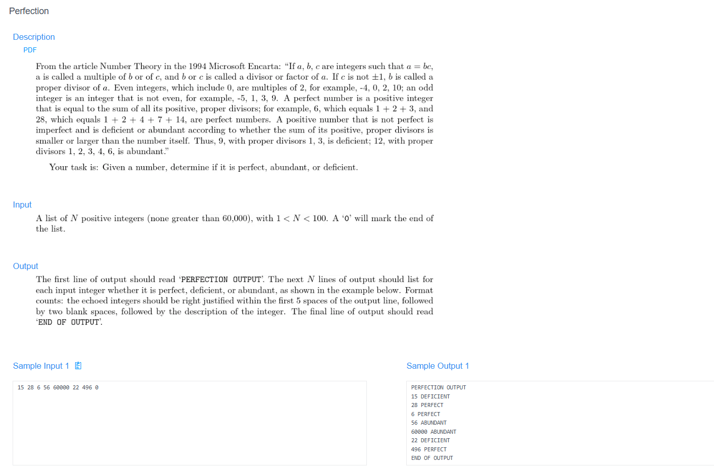

# 🧠 Detailed Problem Analysis: Perfection

## 📋 Problem Description

- **Official Platform Link:** [Perfection](https://cpex.cs.pu.edu.tw/contest/3/problem/Ex3-Q4)

---

## 🛠️ Section 1: Algorithm & Data Structure Foundation

### 1. Primary Data Structure Choice
This problem evaluates mathematical factor distribution properties, requiring an **$O(1)$ dynamic auxiliary space overhead**. Rather than allocating structural storage structures (like arrays, hash tables, or sets) to cache individual divisors, we can process the numbers dynamically. The divisors are accumulated on the fly into a single scalar integer tracker variable `divisor_sum`.

### 2. Functional Mechanics
The coordination engine classifies a given integer $N$ by summing all its proper divisors (all positive divisors of $N$ excluding $N$ itself):
- **Symmetric Factor Extraction:** Instead of iterating from $1$ all the way to $N-1$ (which causes high delays), divisors always appear in symmetric pairs. If an integer $i$ divides $N$ perfectly (`N % i == 0`), then the corresponding quotient $N / i$ is also a verified divisor. Therefore, the loop boundary only needs to scan up to the square root threshold: $i \le \sqrt{N}$.
- **Perfect Square Anchor Handling:** If $i \times i = N$, adding both $i$ and $N/i$ would duplicate the same divisor. The algorithm handles this by adding $i$ only once to keep the calculation exact.
- **State Classification Logic:** After calculating the final `divisor_sum`, $N$ is classified into one of three categories:
  - `PERFECT`: If $\text{divisor\_sum} == N$ (e.g., $6 = 1 + 2 + 3$).
  - `DEFICIENT`: If $\text{divisor\_sum} < N$ (e.g., $4 > 1 + 2$).
  - `ABUNDANT`: If $\text{divisor\_sum} > N$ (e.g., $12 < 1 + 2 + 3 + 4 + 6$).
- **Termination Sentinel Gate:** The multi-case text stream processes integers sequentially, stopping immediately when it reads the sentinel token `0`.

---

## 🚀 Section 2: Advanced Code Optimization Strategies

To meet the strict time limits of Online Judges when processing large batches of inputs, the code uses two key optimization strategies:

### 1. Square Root Scanning Frontier ($O(\sqrt{N})$ Complexity)
Looping sequentially up to $N-1$ would cause a severe $O(N)$ linear delay, which would result in a *Time Limit Exceeded (TLE)* error on large numbers. Cutting the search space down to $\sqrt{N}$ reduces execution time to a highly efficient **$O(\sqrt{N})$ complexity layer**.

### 2. Tabular Output Formatting (Right-Aligned Padding)
Online Judges enforce strict formatting guidelines for this problem's output. The integer $N$ must occupy a fixed field width of exactly 5 characters, aligned to the right. Python handles this elegantly without manual string concatenations by using string formatting expressions like `f"{n:>5}"`.

### 📊 Structural Complexity Comparison Chart
| Optimization Phase | Time Complexity | Space Complexity | Resource Benefit |
| :--- | :--- | :--- | :--- |
| **Linear Divisor Loop** | $O(N)$ | $O(1)$ | High risk of TLE when processing large input pools. |
| **Square Root Sweep Loop** | **$O(\sqrt{N})$ Strict** | **$O(1)$ Zero Allocation** | **Instantaneous execution with minimal memory usage.** |

---

## 🔍 Section 3: Bug Hunting & Debugging Diagnostics

During the engineering lifecycle of this solution, the following technical traps were caught and resolved:

### 1. Common Logical Pitfalls (Bugs Checked)
- **The $N=1$ Boundary Failure:** Passing $1$ into standard divisor loops often causes logic errors. Since its only proper divisor less than itself does not exist, the `divisor_sum` must evaluate to `0`. If the code incorrectly initializes or structures the loops, it might return $1$, leading to a false `PERFECT` classification instead of the correct `DEFICIENT` tag.
- **Perfect Square Over-Counting:** Forgetting to separate the symmetric divisor accumulation checks when $i = \sqrt{N}$. For instance, when evaluating $N=16$, the loop adds $4$ twice, throwing off the `divisor_sum` accuracy.
- **Output Presentation Errors:** Miscalculating string spaces or missing the header/footer markers (e.g., `"PERFECTION OUTPUT"` and `"END OF OUTPUT"`), which can trigger a *Presentation Error (PE)* on the platform.

### 2. Debug Strategy Blueprint
- **Boundary Anchor Checks:** Explicitly run edge cases like `1`, perfect squares like `16` or `25`, and known perfect numbers like `6` and `28` to ensure the mathematical states evaluate flawlessly.
- **Format Padding Inspections:** Print strings wrapped in distinct characters (e.g., `|[PERFECTION OUTPUT]|`) during local testing to visually verify that right-alignment spacing matches the 5-character requirement.

---

## 🔗 Section 4: Resource Sharing
- **My Solution :** [perfection.py](perfection.py)
- **Academic Reference Portfolio:** [link](https://zerojudge.tw/ShowProblem?problemid=c032)
