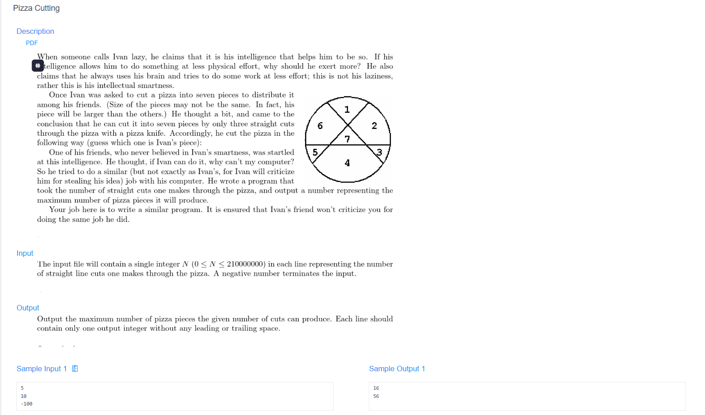

# 🧠 Detailed Problem Analysis: Pizza Cutting

## 📋 Problem Description

- **Official Platform Link:** [Pizza Cutting](https://cpex.cs.pu.edu.tw/contest/1/problem/Ex1-Q2)

---

## 🛠️ Section 1: Algorithm & Data Structure Foundation

### 1. Primary Data Structure Choice
To achieve high-efficiency evaluation, two core memory layouts are deployed:
- **2D Prefix Sum (`preSum`):** Stores the aggregated topping count from coordinate $(r, c)$ to the bottom-right corner of the grid. This preprocessing steps allows $O(1)$ constant time complexity checking to determine if any given slice contains at least one target topping.
- **3D Memoization Table (`dp`):** Stores precomputed results for a distinct state denoted as $(k, r, c)$ to completely eliminate redundant recursive calculations across overlapping branches.
  - `k`: Remaining cuts to be made.
  - `r, c`: Top-left coordinates defining the boundaries of the current pizza piece.

### 2. Functional Mechanics
The execution engine follows a Top-Down strategy broken down into two explicit conceptual phases:
- **Recursive Splitting (DFS):**
  - **Horizontal Cuts:** Iterate through rows $nr > r$. If the isolated upper slice contains toppings, the system triggers recursive logic for the remaining bottom piece with $k-1$ remaining cuts.
  - **Vertical Cuts:** Iterate through columns $nc > c$. If the isolated left slice contains toppings, the system triggers recursive logic for the remaining right piece with $k-1$ remaining cuts.
- **Trapping & Base Cases:**
  - **Failure State:** If the current evaluated piece has $0$ toppings, this partition path is invalid and returns $0$ instantly.
  - **Success State:** If $k == 0$ (meaning all required cuts have been successfully made and the final piece still contains toppings), it returns $1$.
  - **Modulo Arithmetic:** To prevent critical integer overflow errors, all mathematical additions perform a modulo operation against $\% 10^9 + 7$.

---

## 🚀 Section 2: Advanced Code Optimization Strategies

To improve computational throughput and eliminate external constraints, the solution evolved through two optimization tiers:

### 1. Space Optimization via Iterative Layer Reduction
Since the state calculation for the current cut level $k$ only depends directly on the matrix states computed at level $k-1$, we can theoretically compress the 3D DP table down into a 2D space allocation using an iterative grid layer approach. This optimization strategy severely drops the structural memory overhead without affecting the time complexity.

### 2. Performance Optimization via 2D Prefix Sum Querying
Instead of re-counting toppings inside the slice dimensions loops using nested grids tracking ($O(N^2)$ per slice), preprocessing the board into a 2D PreSum matrix optimizes the topping verification step down to a rigid **$O(1)$ lookup execution**, maximizing recursion speed.

### 📊 Structural Complexity Comparison Chart
| Optimization Phase | Time Complexity | Space Complexity | Resource Benefit |
| :--- | :--- | :--- | :--- |
| **Naive DFS Recursion** | $O(2^{N})$ | $O(N)$ (Stack) | Extremely high runtime risk (TLE). |
| **3D Top-Down DP Model** | $O(k \cdot N^3)$ | $O(k \cdot N^2)$ | Skips redundant calculations entirely. |
| **2D Iterative Space Model** | $O(k \cdot N^3)$ | **$O(N^2)$ Strict Optimization** | Minimal runtime memory footprint. |

---

## 🔍 Section 3: Bug Hunting & Debugging Diagnostics

During the engineering lifecycle of this solution, the following technical traps were caught and resolved:

### 1. Common Logical Pitfalls
- **Off-by-One Errors:** Encountering incorrect loop boundary conditions inside either the initial `preSum` matrix calculation or the row/column cut iterations (e.g., mistaking $nr < \text{rows}$ for $nr \le \text{rows}$), causing out-of-bounds execution.
- **Modulo Mistakes:** Forgetting to consistently apply the $\% 1,000,000,007$ operator at every addition accumulation step, leading to corrupted negative values via integer overflow.
- **Invalid Cuts:** Failing to verify that $\text{preSum}[r][c] - \text{preSum}[nr][c] > 0$ before initiating a recursion path, resulting in slices without toppings (violating problem requirements).
- **Overlapping Subproblems (Time Limit Exceeded):** Forgetting to look up or store results into the `dp` table properly, causing the algorithm to re-evaluate identical sub-grids and trigger a system timeout crash.

### 2. Isolation & Validation Blueprint
To prevent regression when applying optimizations, the testing phase utilizes these isolation rules:
- **Dry Running Core Edge Cases:** Isolating verification tests when $k=1$ (the final piece) to ensure it correctly validates the presence of toppings, and verifying that a board with zero toppings triggers immediate exit.
- **Decoupled Function Inspection:** Extracting the 2D range sum calculation block into an isolated helper routine (`getAppleCount`) to confirm it correctly evaluates multi-grid coordinates independently before embedding it inside main pointer routines.

---

## 🔗 Section 4: Resource Sharing
- **My Solution (3D Memoization):** [pizza_cutting_3d_dp.cpp](pizza_cutting_3d_dp.cpp)
- **Academic Reference Portfolio:** [link](https://leetcode.com/problems/number-of-ways-of-cutting-a-pizza/solutions/623732/javacpython-dp-prefixsum-in-matrix-clean-z2is/)
