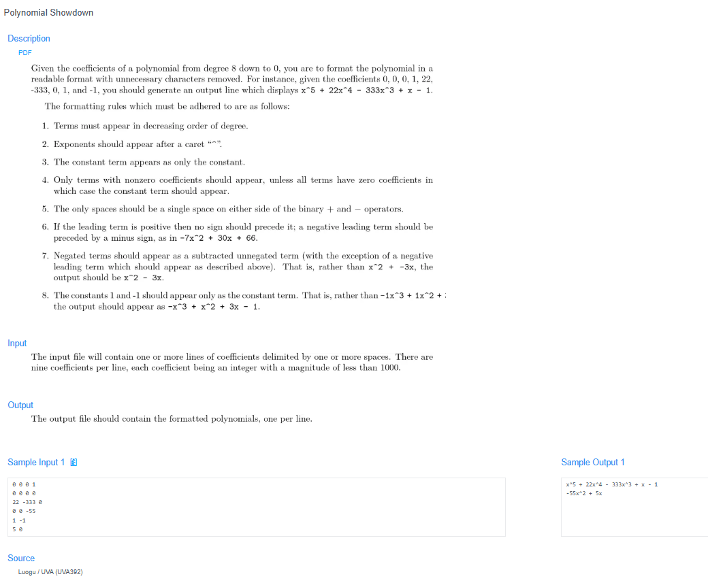

# 🧠 Detailed Problem Analysis: Polynomial Showdown

## 📋 Problem Description

- **Official Platform Link:** [Polynomial Showdown](https://cpex.cs.pu.edu.tw/contest/5/problem/Ex5-Q1)

---

## 🛠️ Section 1: Algorithm & Data Structure Foundation

### 1. Primary Data Structure Choice
This problem acts as a stateful string-builder, demanding **$O(1)$ constant dynamic space overhead** beyond the output buffer. The 9 input coefficients are loaded directly into a standard fixed-size sequential list. We parse each element dynamically from index position $0$ (representing $x^8$) down to $8$ (representing the constant term $x^0$).

### 2. Functional Mechanics
The formatting engine translates raw integer coefficients into a human-readable algebraic string by applying strict conditional formatting rules:
- **Zero Coefficient Suppression:** Any term where the coefficient equals `0` must be completely omitted from the output, unless the entire polynomial consists solely of zeros (in which case it outputs `"0"`).
- **First Active Term (Head State):** The very first non-zero term printed must *not* have a leading plus sign if it is positive (e.g., printing `3x^8` instead of `+ 3x^8`). If it is negative, it receives a direct minus sign with no space (e.g., `-3x^8`).
- **Subsequent Terms (Body State):** All following non-zero terms must be separated by an explicit sign wrapped in spaces: `" + "` for positive values and `" - "` for negative values.
- **Coefficient Magnitude Reduction:** The coefficient number `1` is hidden if a power variable is present (e.g., writing `x^5` instead of `1x^5`, or `- x^5` instead of `- 1x^5`). It is only preserved if the power degrades to $x^0$ (the constant term).
- **Power Variable Layout:**
  - For power $P > 1$, format as `x^P`.
  - For power $P = 1$, drop the caret completely, printing just `x`.
  - For power $P = 0$, drop the variable completely, leaving only the raw coefficient magnitude.

---

## 🚀 Section 2: Advanced Code Optimization Strategies

To manage edge conditions elegantly without building unmaintainable nested structural loops, the code implements two core optimization tiers:

### 1. Boolean First-Term Tracking Flags
Rather than writing messy conditional splits based on array indexes to look back or guess if a term is the first one printed, a simple boolean flag `is_first` tracks the print state. It stays `True` until the first non-zero value is processed, ensuring clear separation of code logic between the polynomial's "head" and "body".

### 2. String Token List Compiling
Instead of frequently performing slow string additions (`str1 += str2`), which recreates string structures in memory repeatedly, terms are appended to a temporary list. They are then joined at the end using `"".join(terms)`, which executes much faster.

### 📊 Structural Complexity Comparison Chart
| Optimization Phase | Time Complexity | Space Complexity | Resource Benefit |
| :--- | :--- | :--- | :--- |
| **String Concat Loop** | $O(K^2)$ | $O(K)$ | Incurs structural copy overhead for each term concatenation. |
| **List Token Join Execution**| **$O(K)$ Strict** | **$O(K)$ Buffer** | **Optimal string builder layout running at maximum speed.** |

*Note: Here, $K = 9$ represents the fixed number of polynomial coefficients per line.*

---

## 🔍 Section 3: Bug Hunting & Debugging Diagnostics

During the engineering lifecycle of this solution, the following technical traps were caught and resolved:

### 1. Common Logical Pitfalls (Bugs Checked)
- **The Zero-Out Void Defect:** If all nine coefficients read as `0`, a basic loop skips everything and leaves the output string completely empty. The engine must check for this case explicitly and return `"0"`.
- **Mismatched Space Padding:** Placing spaces inconsistently around signs (e.g., writing `- x^2` at the very front of the expression instead of `-x^2`). Leading negative signs must be attached directly to the term, while intermediate signs require spaces on both sides.
- **Constant Value Deletion:** Accidentally deleting a constant coefficient because its value is `1` or `-1`. While `1x^2` simplifies to `x^2`, a constant term like `1` or `-1` at the end must not be erased.

### 2. Debug Strategy Blueprint
- **All-Zero Input Run:** Feed `0 0 0 0 0 0 0 0 0` into the system to confirm it outputs exactly `0`.
- **Unit Value Sign Sweeps:** Pass inputs like `0 0 0 0 0 0 0 1 -1` to verify that the linear components print accurately as `x - 1` without displaying broken entries like `1x - 1` or `x -1`.

---

## 🔗 Section 4: Resource Sharing
- **My Solution :** [polynomial_showdown.py](polynomial_showdown.py)
- **Academic Reference Portfolio:** [link](https://zerojudge.tw/ShowProblem?problemid=c060)
