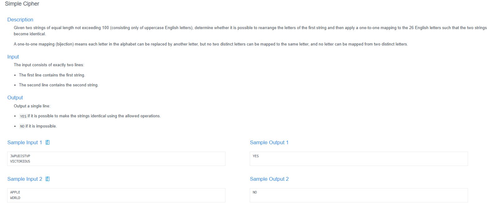
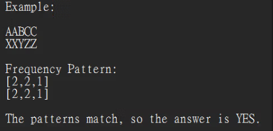

# 🧠 Detailed Problem Analysis: Simple Cipher (Ancient Cipher)

## 📋 Problem Description

- **Official Platform Link:** [Simple Cipher](https://cpex.cs.pu.edu.tw/contest/6/problem/ACP2026-Q4)

---

## 🛠️ Section 1: Analyze INPUT

According to the technical specifications from the Padlet system notes:
- **Core Input Structure:** The input stream provides two encrypted cipher text strings, $S_1$ and $S_2$, on separate rows.
- **Data Attributes:** Both strings consist entirely of uppercase English alphabet letters (`A` through `Z`).
- **Length Constraint:** The length of both strings is identical and bounded: $1 \le |S_1|, |S_2| \le 100$.
- **Sample Pairs Checked:**
  1. `AAAA` and `BBBB` $\rightarrow$ Expected Output: `YES`
  2. `AABBCC` and `XXYYZZ` $\rightarrow$ Expected Output: `YES`
  3. `JWPUDJSTVP` and `VICTORIOUS` $\rightarrow$ Expected Output: `YES`
  4. `APPLE` and `WORLD` $\rightarrow$ Expected Output: `NO`

---

## 📐 Section 2: Design PROCESS

The core evaluation framework relies on analyzing character frequency distributions rather than attempting brute-force substitution mapping:

### 1. Cryptanalysis Equivalency Rules
- **Permutation Invariance:** Rearranging the order of letters does not change the total occurrence counts of individual characters within the string.
- **One-to-One Substitution Mapping:** A bijection mapping rule requires that if letter $C_1$ converts to $C_2$, then every single occurrence of $C_1$ transforms uniformly into $C_2$. Thus, the frequency fingerprint profile of both strings must be completely identical when sorted.
- **Validation Condition:** 1. Calculate the frequency of each of the 26 characters for both strings.
  2. Sort both frequency arrays in ascending order.
  3. Compare the sorted lists. If `Sorted_Freq(S1) == Sorted_Freq(S2)`, return `YES`. Otherwise, return `NO`.

### 2. Key Patern

*Figure: Architectural flowchart tracking character hash count tracking and sorted list comparison paths.*

---

## 📤 Section 3: Plan OUTPUT

The system output must conform strictly to the specified target strings expected by the online evaluation tool:
- **Presentation Content:** Output a single verification flag string indicating if the one-to-one cipher translation layout is possible.
- **Strict Formatting Constraints:** Output values are case-sensitive and must be written completely in uppercase with no extra whitespace:
  - `YES` (If a valid mapping configuration exists)
  - `NO` (If frequency patterns do not match)

---

## 🗄️ Section 4: Data Container

The memory architecture maps location data using optimized sequence vectors to maintain frequency records:
- **Input Text Buffers (`s1`, `s2`):** String structures holding the target cipher elements.
- **Frequency Counters (`count1`, `count2`):** Fixed-size numerical array vectors containing 26 integer slots, where each slot represents an alphabet code index (`ord(char) - ord('A')`).

### Container Lifespan Lifecycle Table (Tracing Pair: `APPLE` and `WORLD`):
| Processing Stage | Vector Target | Array Layout State State (Non-Zero Only) | Operational Analysis Details |
| :--- | :--- | :--- | :--- |
| **1. Instantiation** | `s1`, `s2` | `s1 = "APPLE"`, `s2 = "WORLD"` | Loaded string variables into memory. |
| **2. Frequency Map 1**| `count1` | `A:1, P:2, L:1, E:1` | Scanned `s1`. Unsorted profiles: `[1, 0, 0, 0, 1, ..., 1, 2, ...]` |
| **3. Frequency Map 2**| `count2` | `W:1, O:1, R:1, L:1, D:1` | Scanned `s2`. Unsorted profiles: `[0, 0, 0, 1, 0, ..., 1, 1, ...]` |
| **4. Structural Sort**| Both Lists | `count1` $\rightarrow$ `[..., 1, 1, 1, 2]`; `count2` $\rightarrow$ `[..., 1, 1, 1, 1, 1]` | Sorted frequencies to normalize patterns. |
| **5. Equivalence Evaluation**| `count1 == count2` | `False` (Since the frequency subsets `[1,1,1,2]` $\neq$ `[1,1,1,1,1]`) | Discovered structural mismatch. |
| **6. Output Flush** | String Formatter | `"NO"` | Flushed final target label result to console. |

---

## 🚀 Section 5: Algorithm

The step-by-step logic execution pipeline runs according to these linear sequence bounds:
1. **Step 1 (Input Parse):** Read the two target string sequences $S_1$ and $S_2$ from the data stream.
2. **Step 2 (Initialize Buffers):** Set up two array registers, `count1` and `count2`, filled with twenty-six zero items.
3. **Step 3 (Populate Count 1):** Iterate through each character in $S_1$, calculate its offset index `idx = ord(char) - ord('A')`, and increment `count1[idx]`.
4. **Step 4 (Populate Count 2):** Iterate through each character in $S_2$, calculate its offset index `idx = ord(char) - ord('A')`, and increment `count2[idx]`.
5. **Step 5 (Frequency Normalization Sort):** Sort both `count1` and `count2` arrays independently in ascending order.
6. **Step 6 (Identity Validation Check):** Compare the sorted tracking arrays. If they match identically, assign output state as `"YES"`. Otherwise, assign output state as `"NO"`.
7. **Step 7 (Console Flush):** Print the evaluated result string directly to the system terminal stream.

---

## 🔗 References
- **My Solution :** [simple_cipher.py](simple_cipher.py)
- **Academic Reference Portfolio:** [link](https://padlet.com/htchutaiwan/cpe-code-studies-padlet-d-ep7vprch31zhf4zp)
