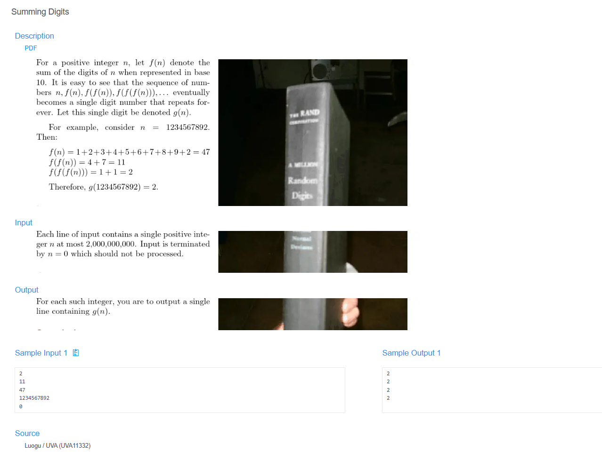

# 🧠 Detailed Problem Analysis: Summing Digits

## 📋 Problem Description

- **Official Platform Link:** [Summing Digits](https://cpex.cs.pu.edu.tw/contest/3/problem/Ex3-Q3)

---

## 🛠️ Section 1: Algorithm & Data Structure Foundation

### 1. Primary Data Structure Choice
This problem processes structural digit aggregation recursively until a single-digit terminal state is reached, requiring **$O(1)$ auxiliary dynamic space overhead**. Instead of mapping characters into array containers, digits are peeled away using primitive scalar mathematical operations. Python's native support for arbitrary-precision integers ensures that huge number configurations pass through without triggering data truncation.

### 2. Functional Mechanics
The calculation engine takes an initial positive integer $N$ and passes it through an iterative reduction loop structured into two functional phases:
- **Digit Stripping Phase:** While the target number contains multiple digits, a nested sub-loop extracts the low-order digit using the modulo operator `n % 10`, accumulating it into a local tracker variable `digit_sum`. The number is then truncated via integer floor division `n // 10`.
- **State Transition Convergence:** Once the sub-loop completely drains the original number, the global state reassigns the value of $N$ to the newly computed `digit_sum`. This overarching process loops continuously until $N$ naturally drops below $10$, signaling a single-digit terminal state.
- **Termination Sentinel Gate:** The continuous line-streaming reader evaluates incoming entries instantly, terminating execution the moment it catches the sentinel marker integer `0`.

---

## 🚀 Section 2: Advanced Code Optimization Strategies

To maximize execution throughput across extensive Online Judge evaluation test batches, the solution integrates two distinct optimization pathways:

### 1. Mathematical Digital Root Optimization ($O(1)$ Time)
Instead of forcing a multi-stage simulation loop that manually adds digits step-by-step, number theory proves that the iterative sum of digits is congruent to the **Digital Root** of a number. The entire calculation can be shortcutted down to a **strict $O(1)$ constant time execution** using a closed-form modulo formula:
$$\text{Digital Root}(N) = 1 + ((N - 1) \pmod 9)$$
Applying this property cuts out nested loop operations entirely, maintaining completely flat execution speeds even if $N$ spans up to massive numeric limits.

### 2. High-Speed Direct Integer Streaming
Using Python's direct integer arithmetic loops instead of heavy casting methods (like converting back and forth via `str(n)`) bypasses standard string allocation delays at the compiler level, optimizing raw processing speeds.

### 📊 Structural Complexity Comparison Chart
| Optimization Phase | Time Complexity | Space Complexity | Resource Benefit |
| :--- | :--- | :--- | :--- |
| **String Conversion Loop** | $O(\text{Iterations} \cdot \log N)$ | $O(\log N)$ | Incurs heavy structural allocation and character parsing costs. |
| **Integer Arithmetic Loop** | $O(\text{Iterations} \cdot \log N)$ | $O(1)$ | Clean arithmetic evaluation with no extra allocation. |
| **Mathematical Digital Root**| **$O(1)$ Strict Constraint** | **$O(1)$ Zero Memory**| **Instantaneous execution using direct modular math formulas.** |

---

## 🔍 Section 3: Bug Hunting & Debugging Diagnostics

During the engineering lifecycle of this solution, the following technical traps were caught and resolved:

### 1. Common Logical Pitfalls (Bugs Checked)
- **The Modulo-9 Edge Defect:** Using a simple `N % 9` fallback formula to calculate the digital root. While this maps correctly for most numbers, it breaks completely when $N$ is a multiple of 9 (e.g., $N=18 \rightarrow 18 \pmod 9 = 0$). Since the final result must be a single digit from 1 to 9, returning `0` flags an immediate *Wrong Answer (WA)*. The adjusted formula `1 + (N - 1) % 9` fixes this edge case flawlessly.
- **Sentinel Collision Failure:** Placing the exit trigger checks *below* or inside the loop accumulation block, causing the program to output an unwanted `0` string entry for the terminating marker line itself.
- **State Leakage:** Forgetting to clear or reset the inner `digit_sum` counter back to zero between consecutive reduction phases, causing values to overflow and accumulate indefinitely.

### 2. Debug Strategy Blueprint
- **Multiple-of-9 Anchor Tests:** Explicitly run benchmark numbers like `9`, `18`, and `81` to confirm that the mathematical reduction routines correctly yield `9` rather than crashing to `0`.
- **Single Digit Verification:** Feed simple values like `5` or `7` into the system to verify that the algorithm bypasses the core loops completely and prints them unmodified.

---

## 🔗 Section 4: Resource Sharing
- **My Solution :** [summing_digits.py](summing_digits.py)
- **Academic Reference Portfolio:** [link](https://blog.csdn.net/mobius_strip/article/details/13089821)
