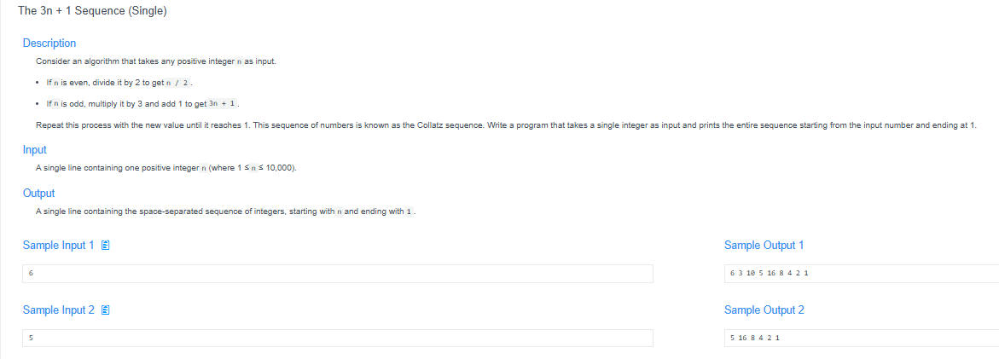
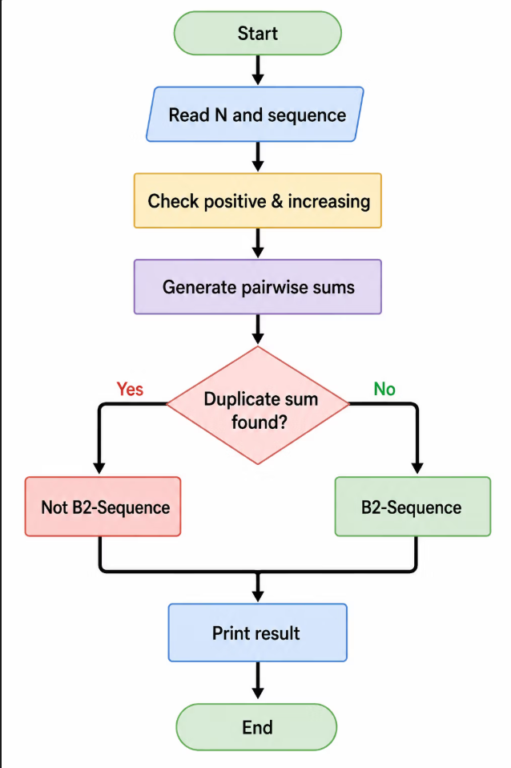

# 🧠 Detailed Problem Analysis: The 3n + 1 Sequence (Single)

## 📋 Problem Description

- **Official Platform Link:** [The 3n + 1 Sequence(singer)](https://cpex.cs.pu.edu.tw/contest/6/problem/ACP2026-Q1)

---

## 🛠️ Section 1: Analyze INPUT

Based on the technical specifications analyzed from the Padlet testing system:
- [cite_start]**Input Data Type:** The system accepts a single positive integer $n$ as the primary initial input[cite: 3].
- [cite_start]**Constraints:** The input value must strictly adhere to the defined domain: $1 \le n \le 10,000$[cite: 3].
- **Validity Criteria:**
  - *Valid Inputs:* The input must be a positive whole integer. [cite_start]It cannot be negative, a decimal, or zero[cite: 3]. [cite_start]For example, values like `1`, `5`, `100`, and `10,000` are completely valid[cite: 3].
  - [cite_start]*Invalid Inputs:* Any values outside the boundary, such as `-3`, `0`, `5.5`, or `10001`, are flagged as invalid[cite: 3].
- [cite_start]**Purpose:** The integer $n$ serves as the starting point of the $3n + 1$ (Collatz) sequence[cite: 3]. [cite_start]The program initiates with this number and continuously triggers transformation rules until the stream successfully collapses down to `1`[cite: 3].

---

## 📐 Section 2: Design PROCESS

[cite_start]The mathematical transformation of the $3n + 1$ algorithm is a deterministic process that mutates the current number based on its parity[cite: 118]:

### 1. Core Transformation Rules
- [cite_start]**Rule 1 (Even Numbers):** If the current value is perfectly divisible by 2 ($n \pmod 2 == 0$), the next number is generated via floor division by 2 ($n \rightarrow \frac{n}{2}$)[cite: 3, 119].
- [cite_start]**Rule 2 (Odd Numbers):** If the current value is an odd number ($n \pmod 2 \neq 0$), the next sequence state is evaluated by multiplying the number by 3 and adding 1 ($n \rightarrow 3n + 1$)[cite: 3, 121].
- [cite_start]**Rule 3 (Termination Switch):** The algorithm repeatedly executes Rules 1 and 2 until the tracking sequence drops down exactly to the base value `1`, where it hits the stop switch[cite: 3, 122].

### 2. Flowchart Logic

*Figure: Structural workflow tracking the conditional loop execution of the single Collatz algorithm.*

---

## 📤 Section 3: Plan OUTPUT

The presentation formatting on the Online Judge platform requires absolute precision regarding spaces and stream delimiters:
- [cite_start]**Row Configuration:** The entire sequence generated from the initial value $n$ to the termination element `1` must be printed on a single line[cite: 65]. [cite_start]All numbers must be separated by exactly **one single space** (`end=" "`)[cite: 65].
- [cite_start]**Termination Cleanout:** As soon as the tracking value encounters the boundary limit `1`, the loop stops[cite: 114]. [cite_start]The final `1` must be printed to finish the sequence sequence cleanly, followed by a standard line break[cite: 70].
- [cite_start]**Concrete Example:** For an initial input number of $6$, the console output layout must match exactly[cite: 3, 65]:
  [cite_start]`6 3 10 5 16 8 4 2 1` [cite: 3, 65]

---

## 🗄️ Section 4: Data Container

To track and manage the dynamic state shifts of the Collatz sequence in memory, the program sets up the following components:
- [cite_start]**Primary State Variable (`val`):** An integer container holding the current number being evaluated[cite: 73]. [cite_start]It is continuously overwritten with the newly calculated values at each step[cite: 74].
- [cite_start]**Dynamic Array (`list`):** Since the exact total count of items generated by the Collatz rules is unknown at the start, a Python list is chosen[cite: 79, 80]. [cite_start]It allows the program to add elements dynamically without manual resizing overhead, preserving chronological order[cite: 80, 81].

### Container Lifespan Lifecycle Table (Tracing Input $n = 6$):
| Stage | Code Expression | State in Memory | Operations & System Notes |
| :--- | :--- | :--- | :--- |
| **1. Creation** | `sequence = []` | `[]` | [cite_start]Allocates memory structure for a clean, empty list[cite: 92, 103]. |
| **2. Loop Appends** | `sequence.append(str(val))` | `['6', '3', '10', '5', '16', '8', '4', '2']` | [cite_start]Grows linearly by one element per iteration, storing string states[cite: 84, 93, 103]. |
| **3. Final Entry** | `sequence.append('1')` | `['6', '3', '10', '5', '16', '8', '4', '2', '1']` | [cite_start]Inserts the mandatory termination constant `1`[cite: 94, 103]. |
| **4. Flattening** | `" ".join(sequence)` | `"6 3 10 5 16 8 4 2 1"` | [cite_start]Compresses the list elements into a single blank-spaced row[cite: 95, 98, 104]. |

---

## 🚀 Section 5: Algorithm

The step-by-step pseudocode execution process operates conceptually as follows:
1. [cite_start]**Step 1 (Input):** Read the starting number sequence from the platform stream and store it inside the `val` container[cite: 110, 125].
2. [cite_start]**Step 2 (Record State):** Log the current string representation of `val` into the sequence array layout[cite: 126].
3. [cite_start]**Step 3 (Evaluate Termination):** Check if `val` is equal to 1[cite: 127]. [cite_start]If Yes, stop the loop operation and jump directly to Step 6[cite: 128].
4. [cite_start]**Step 4 (Determine Parity):** Evaluate whether `val` is even or odd[cite: 130]:
   - [cite_start]If Even (`val % 2 == 0`): Transition the value via `val // 2`[cite: 112, 131].
   - [cite_start]If Odd (`else`): Transition the value via `3 * val + 1`[cite: 113, 132].
5. [cite_start]**Step 5 (Loop Iteration):** Return to Step 2 with the updated value of `val`[cite: 133].
6. [cite_start]**Step 6 (Output Presentation):** Flatten the structural data container into a space-delimited string and push it to the system output stream[cite: 128].

---

## 🔗 References
- **My Solution :** [collatz_single.py](collatz_single.py)
- **Academic Reference Portfolio:** [link](https://padlet.com/htchutaiwan/cpe-code-studies-padlet-a-f2sd1nwvu5nnis83)
