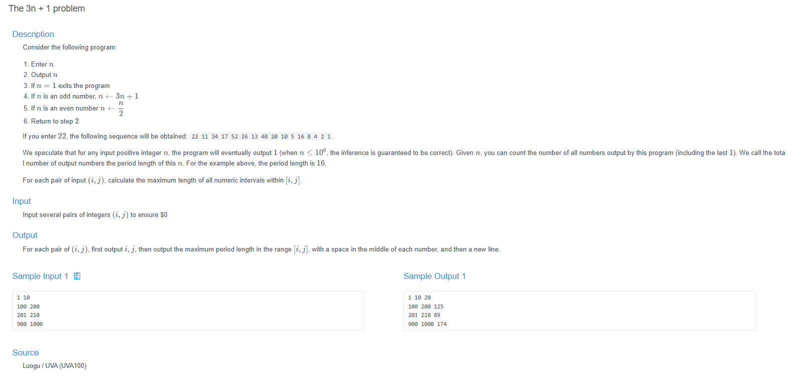

# 🧠 Detailed Problem Analysis: The 3n + 1 Problem (Collatz Conjecture)

## 📋 Problem Description

- **Official Platform Link:** [The 3n + 1 problem](https://cpex.cs.pu.edu.tw/contest/1/problem/Ex1-Q3)

---

## 🛠️ Section 1: Algorithm & Data Structure Foundation

### 1. Primary Data Structure Choice
The structural framework utilizes two explicit layers depending on execution depth:
- **Basic Approach:** Uses only primitive storage variables (`long long` integers) to track standard iteration sequences and maximum value captures. No auxiliary data allocations are required for the standard brute-force execution loop.
- **Optimized Approach (Memoization):** Implements a direct-access dynamic **Array or Hash Map** cache layer. This structures a global memory container where the calculated cycle length of any given integer is recorded. If a sequence trajectory intersects a previously computed "known" number, the execution immediately aggregates the stored count and breaks early.

### 2. Functional Mechanics
The calculation engine operates via a linear range scanning sequence broken into three distinct execution phases:
- **Range Iteration:** Loops through every active integer $n$ enclosed within a given query interval $[i, j]$. 
  * *Boundary Rule:* If the input evaluates to $i > j$, the boundary parameters are automatically swapped at initialization to preserve interval traversal stability.
- **Collatz Transformation Logic:** For every individual tracking integer $n$, the system applies mathematical piecewise reduction constraints repeatedly until the state converges strictly down to $n = 1$:
  - **If $n$ is even:** $n \rightarrow n / 2$
  - **If $n$ is odd:** $n \rightarrow 3n + 1$
- **Cycle Counting & Record Tracking:** Tracks an active local accumulator counter recording the exact mathematical steps taken for $n$ to hit base 1 (including the final 1 state). The maximum global tracker evaluates this local metric against current records, updating the running maximum whenever an upper limit is breached.

---

## 🚀 Section 2: Advanced Code Optimization Strategies

To process inputs efficiently across large search ranges without timing out, the core compiler implementation integrates three major optimizations:

### 1. Bitwise Speed Optimization
Instead of relying on heavy CPU hardware arithmetic divisions or standard modulo operators, the reduction steps are refactored using low-level bitwise operations:
- The parity check (`n % 2 != 0`) is replaced with a bitwise AND query: `(n & 1)`.
- The division step (`n / 2`) is replaced with a bitwise right-shift operator: `n >>= 1`.
These primitives compile directly into high-speed CPU cycles, drastically speeding up millions of batch operations.

### 2. Dynamic Cache Caching (Memoization)
By referencing a global lookup cache array, the recurrence chain cuts off redundant calculation trees. When a new calculation hits a cached sector, the sub-loop terminates instantly, translating exponential search tracks into a linear operation window.

### 📊 Structural Complexity Comparison Chart
| Optimization Phase | Time Complexity | Space Complexity | Resource Benefit |
| :--- | :--- | :--- | :--- |
| **Naive Brute-Force** | $O(\text{Range} \cdot \text{Steps})$ | $O(1)$ | High risk of Time Limit Exceeded (TLE). |
| **Memoization Table Model** | $O(\text{Range} + \text{Unique Steps})$ | $O(\text{Cache Size})$ | Cuts off duplicate calculation branches. |
| **Bitwise + Memoization** | Minimal CPU Cycles | $O(\text{Cache Size})$ | Optimized execution for large input ranges. |

---

## 🔍 Section 3: Bug Hunting & Debugging Diagnostics

During the engineering lifecycle of this solution, the following technical traps were caught and resolved:

### 1. Common Logical Pitfalls (Bugs Checked)
- **Infinite Loop States:** Encountering parity check errors (malfunctioning odd/even filtering blocks) which can misroute sequence flow and cause execution paths to diverge to infinity or freeze up.
- **Integer Overflow Anomalies:** Though a starting number input may appear small, Collatz trajectories frequently surge to extremely large intermediate values. Using a standard signed 32-bit `int` causes a data crash; implementing `long long` limits is strictly mandatory for system safety.
- **Incorrect Range Swapping Faults:** Assuming the input always satisfies $i \le j$. If a query presents an inverse sequence ($i > j$) and the loop executes strictly via `for(int n = i; n <= j; n++)`, the logic completely skips processing and outputs an invalid result.
- **Off-by-One in Cycle Counting:** Forgetting to register the initial element step or omitting the terminal convergence state `1`, which returns cycle metrics consistently lower than expected constraints.

### 2. Debug Strategy Blueprint
- **Input Validation Swaps:** Enforcing strict conditional checks at the entry point to guarantee $i$ and $j$ parameters are sorted in ascending order before passing them into standard loops.
- **Trace Logs Diagnostics:** Inserting debug trace statements to stream the intermediate sequence states of $n$. If negative values appear, it flags an active integer overflow; if sequence strings pattern back into identical numbers without hitting 1, it alerts a logic tracking loop fault.

---

## 🔗 Section 4: Resource Sharing
- **My Solution :** [collatz_optimized.cpp](collatz_optimized.cpp)
- **Academic Reference Portfolio:** [link](https://www.youtube.com/watch?v=094y1Z2wpJg&time_continue=1&source_ve_path=MjM4NTE&embeds_referring_euri=https%3A%2F%2Fpadlet.com%2F)
