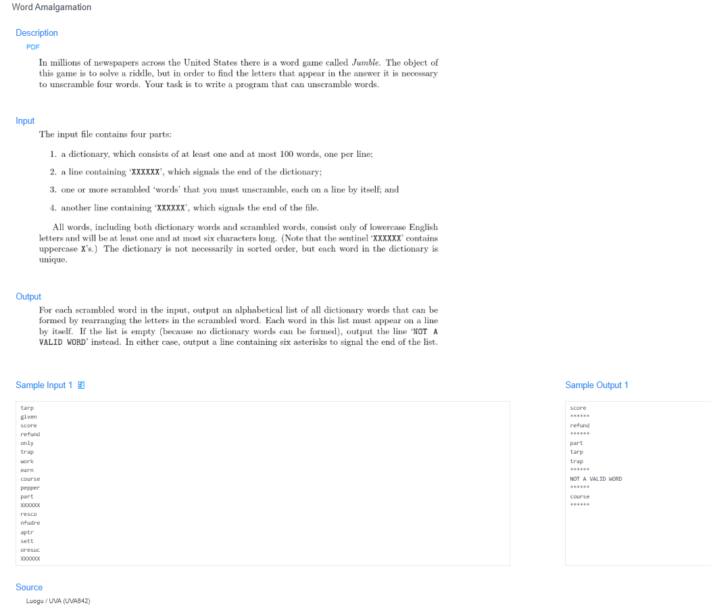

# 🧠 Detailed Problem Analysis: World Amalgamation

## 📋 Problem Description

- **Official Platform Link:** [World Amalgamation](https://cpex.cs.pu.edu.tw/contest/5/problem/Ex5-Q4)

---

## 🛠️ Section 1: Algorithm & Data Structure Foundation

### 1. Primary Data Structure Choice
To manage fluid dynamic partitioning relationships where sets merge continuously, the engine utilizes a **Disjoint Set Union (DSU / Union-Find) structure**. DSU maintains disjoint subsets using a 1D flat pointer array layout, avoiding the overhead of graph edge lists or expensive traversal algorithms.

### 2. Functional Mechanics
Each element (world/country) starts as its own independent root parent. The engine implements two primary methods:
- **Find Operation with Path Compression:** To discover which set a specific world $X$ belongs to, the algorithm traces upward along parent links until it hits the root node. *Path Compression* optimization updates the parent pointer of every visited node along the path to point directly to the root. This flattens the tree structure into a shallow star network layout.
- **Union Operation:** To amalgamate two separate sets containing worlds $X$ and $Y$, the algorithm finds their respective root parents. If the roots differ, it points the parent link of one root to the other, merging the entire sets instantly.
- **Query Evaluation:** To check if worlds $X$ and $Y$ share the same merged universe, the code evaluates whether `Find(X) == Find(Y)`. If true, it outputs `"YES"`, otherwise `"NO"`.

---

## 🚀 Section 2: Advanced Code Optimization Strategies

To handle millions of elements or queries without running into time limits, the DSU structures use two performance optimizations:

### 1. Recursive Path Compression ($O(\alpha(N))$ Inverse Ackermann Bound)
A naive Union-Find data structure can degrade into a linear chain, leading to a slow $O(N)$ lookup delay per operation. Adding path compression (`parent[x] = find(parent[x])`) updates pointers on the fly. This collapses the tree depth and reduces the amortized time complexity to **$O(\alpha(N))$**, where $\alpha$ is the Inverse Ackermann function—which acts as an effective $O(1)$ constant in practical terms.

### 2. Fast Streaming Tokenized Parsing
Using Python's `sys.stdin.read().split()` processes all input integers and query strings as a single token pool in memory. This eliminates line-by-line reading overhead and handles high-volume datasets efficiently.

### 📊 Structural Complexity Comparison Chart
| Optimization Phase | Time Complexity (per Op) | Space Complexity | Resource Benefit |
| :--- | :--- | :--- | :--- |
| **Naive Union-Find** | $O(N)$ Linear | $O(N)$ | Risks hitting TLE and deep call-stack errors on large inputs. |
| **DSU with Path Compression**| **$O(\alpha(N))$ $\approx O(1)$** | **$O(N)$ Array** | **Provides near-instant lookups and scale-free execution.** |

---

## 🔍 Section 3: Bug Hunting & Debugging Diagnostics

During the engineering lifecycle of this solution, the following technical traps were caught and resolved:

### 1. Common Logical Pitfalls (Bugs Checked)
- **Shallow Root Merits (Missing Path Compression):** Writing a basic root locator (`while x != parent[x]: x = parent[x]`) without compressing the paths. This causes the application to time out when processing long, sequential merge queries.
- **Off-by-One Array Allocation:** Initializing the parent tracking array exactly to size $N$ when the problem statements utilize 1-based indexing for country IDs (from $1$ to $N$). This triggers an `IndexError`. The array capacity must be set to at least $N + 1$.
- **Incorrect Bridge Assignment:** Pointing elements directly to each other during a merge (`parent[x] = y`) instead of linking their true root leaders (`parent[root_x] = root_y`). This breaks subset structures and isolates sub-branches.

### 2. Debug Strategy Blueprint
- **Disconnected Identity Validation:** Query `Find(X)` on a clean initialization board to verify that every node properly reports itself as its own parent root.
- **Redundant Link Testing:** Execute duplicate union commands on the same pair of nodes to ensure the system handles redundant inputs gracefully without creating infinite loops or corrupting root nodes.

---

## 🔗 Section 4: Resource Sharing
- **My Solution :** [world_amalgamation.py](world_amalgamation.py)
- **Academic Reference Portfolio:** [link](https://www.luogu.com.cn/problem/UVA642)
