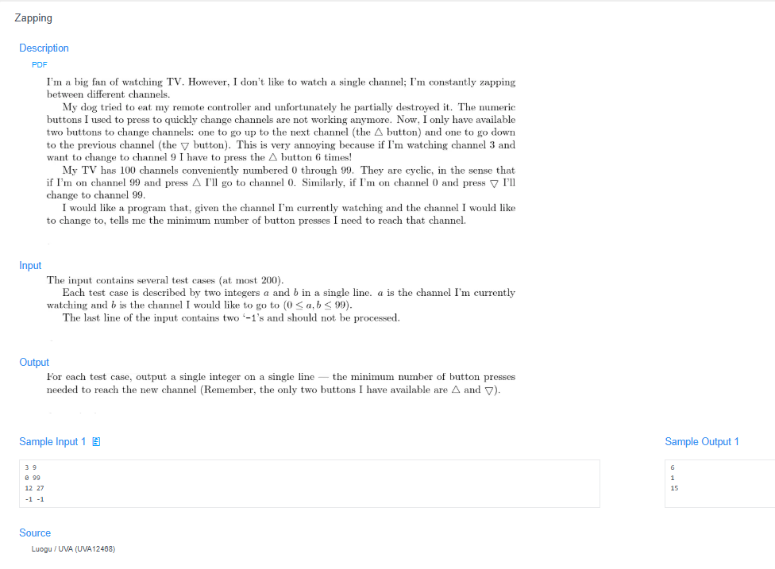

# 🧠 Detailed Problem Analysis: Zapping

## 📋 Problem Description

- **Official Platform Link:** [Zapping](https://cpex.cs.pu.edu.tw/contest/5/problem/Ex5-Q3)

---

## 🛠️ Section 1: Algorithm & Data Structure Foundation

### 1. Primary Data Structure Choice
This problem models a continuous bound traversal on a circular array topology, requiring **$O(1)$ constant dynamic space overhead**. Because the total channel set is fixed exactly from `0` to `99` (exactly 100 channels), we can mathematically evaluate distances without simulating an explicit queue, state machine, or array buffer.

### 2. Functional Mechanics
When navigating from a starting channel $A$ to a destination channel $B$ on a circular dial of 100 channels, there are always two possible directions:
- **Direct Linear Path:** Moving strictly forward or backward without wrapping around the boundaries. The absolute distance is calculated as:
  $$\text{Linear Distance} = |A - B|$$
- **Circular Wrap-Around Path:** Stepping past channel `99` to loop back to `0`, or vice-versa. This distance is the remaining complement of the 100-channel loop:
  $$\text{Wrap Distance} = 100 - |A - B|$$
- **Optimization Strategy:** The algorithm takes the minimum of these two paths to guarantee the fewest possible button presses:
  $$\text{Min Clicks} = \min(\text{Linear Distance}, \text{Wrap Distance})$$
- **Termination Sentinel Gate:** The multi-case text reader processes integer pairs sequentially, terminating execution immediately when it reads the sentinel tokens `-1 -1`.

---

## 🚀 Section 2: Advanced Code Optimization Strategies

To handle massive streaming test runs on the Online Judge instantly, the solution incorporates two optimization layers:

### 1. Mathematical Closed-Form Evaluation ($O(1)$ Complexity)
Instead of simulating button clicks using a step-by-step `while` loop (which causes variable execution lags), using a direct algebraic equation solves the path distance in **strict $O(1)$ constant runtime complexity**. Performance remains completely flat regardless of how far apart the channels are.

### 2. Stream-Based Input Splitting
By utilizing Python's `sys.stdin.read().split()`, the system tokenizes the entire input buffer into memory at once. This removes line-by-line interpretation overhead and handles random spacing cleanly.

### 📊 Structural Complexity Comparison Chart
| Optimization Phase | Time Complexity | Space Complexity | Resource Benefit |
| :--- | :--- | :--- | :--- |
| **Linear Simulation Loop** | $O(\Delta N)$ | $O(1)$ | Execution speed depends on the distance value; inefficient. |
| **Algebraic Parity Selection**| **$O(1)$ Strict** | **$O(1)$ Zero Allocation** | **Instantaneous calculation with maximum platform speed.** |

---

## 🔍 Section 3: Bug Hunting & Debugging Diagnostics

During the engineering lifecycle of this solution, the following technical traps were caught and resolved:

### 1. Common Logical Pitfalls (Bugs Checked)
- **Absolute Value Mismatch:** Forgetting to apply the absolute function (`abs()`) when calculating the direct distance. If $A > B$, then `A - B` yields a positive number but `100 - (A - B)` would add values incorrectly, leading to broken outputs.
- **Wrong Wrap Base Boundary:** Hardcoding an incorrect channel modulus capacity (e.g., using `99` instead of `100` for the total size complement calculation). Even though the channels are numbered `0` to `99`, there are exactly `100` unique states.
- **Sentinel Comparison Errors:** Only checking for a single `-1` or mismatching the exit condition, which can cause the program to continue processing or crash with an `IndexError` at the end of the file.

### 2. Debug Strategy Blueprint
- **Boundary Traversal Verification:** Test corner cases like `0 99` (expected: `1` via wrap-around) and `99 0` (expected: `1` via wrap-around) to confirm the boundary loop logic functions smoothly.
- **Identical Channel Sanity Check:** Pass `45 45` to ensure the absolute difference drops to `0`, returning exactly `0` button presses.

---

## 🔗 Section 4: Resource Sharing
- **My Solution :** [zapping.py](zapping.py)
- **Academic Reference Portfolio:** [link](https://github.com/jlhung/UVA-Python/blob/master/12468%20-%20Zapping.py)
